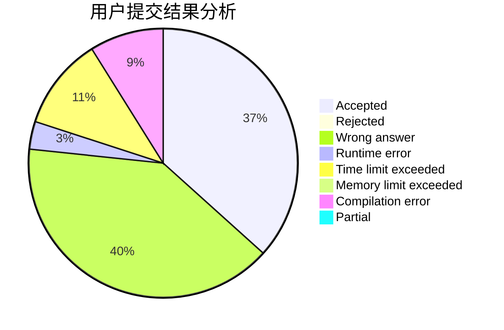
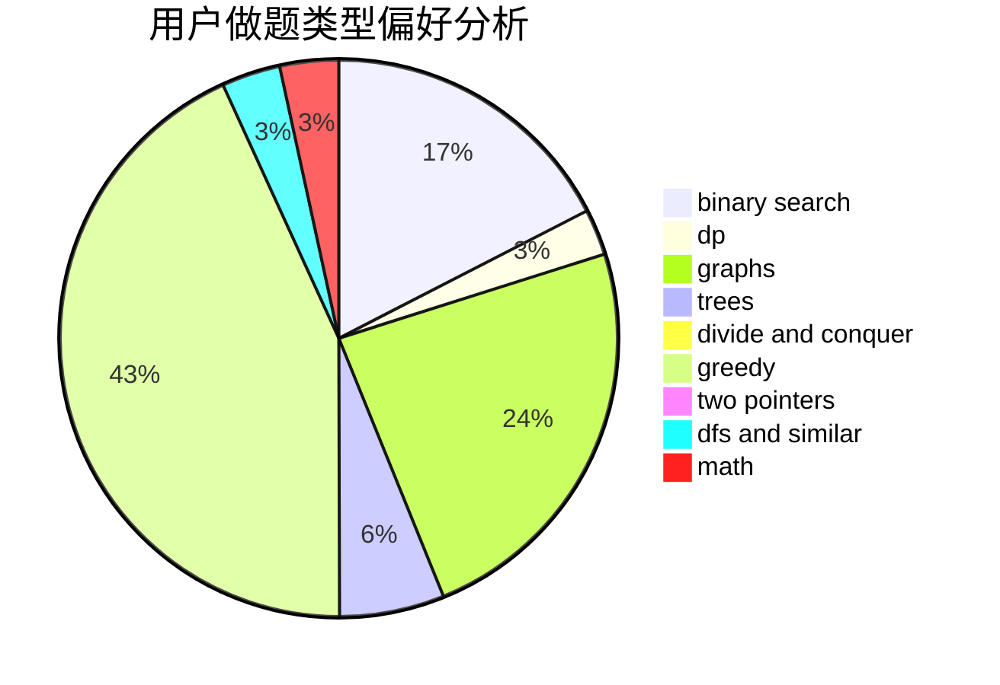

# Calvincheng1231

<!-- tabs:start -->

#### **用户提交结果分析**

#### **用户做题类型偏好分析**

<!-- tabs:end -->
# 推荐题目
[198B](https://codeforces.com/contest/198/problem/B)
[660E](https://codeforces.com/contest/660/problem/E)
[1513D](https://codeforces.com/contest/1513/problem/D)
[1288E](https://codeforces.com/contest/1288/problem/E)
[11E](https://codeforces.com/contest/11/problem/E)
[1101G](https://codeforces.com/contest/1101/problem/G)
[660C](https://codeforces.com/contest/660/problem/C)
[660D](https://codeforces.com/contest/660/problem/D)
[1320E](https://codeforces.com/contest/1320/problem/E)
[521E](https://codeforces.com/contest/521/problem/E)
