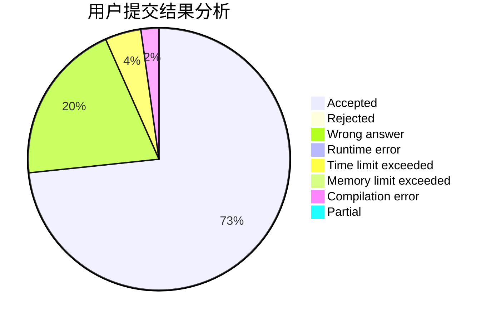
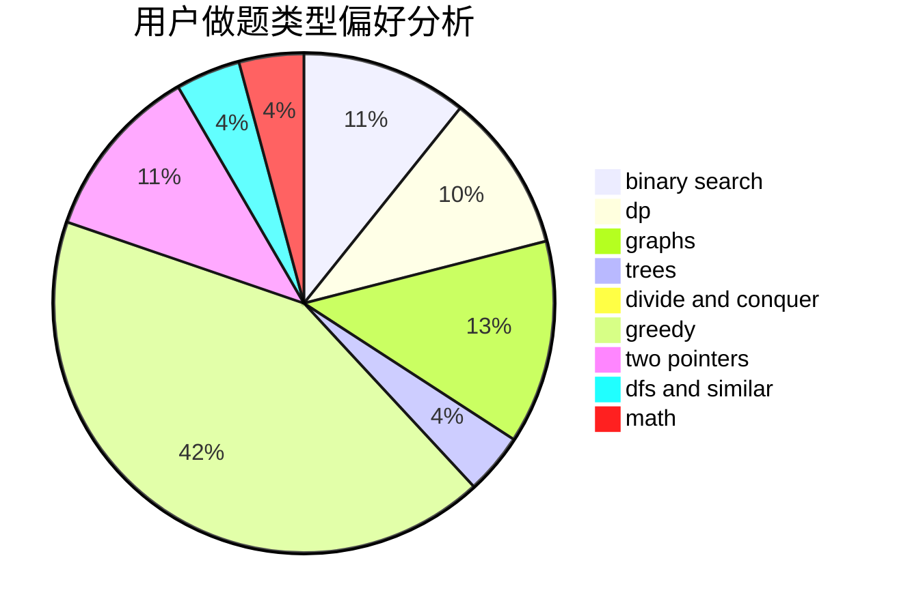

# wk0812

<!-- tabs:start -->

#### **用户提交结果分析**

#### **用户做题类型偏好分析**

<!-- tabs:end -->
# 推荐题目
[630F](https://codeforces.com/contest/630/problem/F)
[810A](https://codeforces.com/contest/810/problem/A)
[665D](https://codeforces.com/contest/665/problem/D)
[1083B](https://codeforces.com/contest/1083/problem/B)
[803B](https://codeforces.com/contest/803/problem/B)
[774C](https://codeforces.com/contest/774/problem/C)
[699D](https://codeforces.com/contest/699/problem/D)
[1362E](https://codeforces.com/contest/1362/problem/E)
[791B](https://codeforces.com/contest/791/problem/B)
[894B](https://codeforces.com/contest/894/problem/B)
