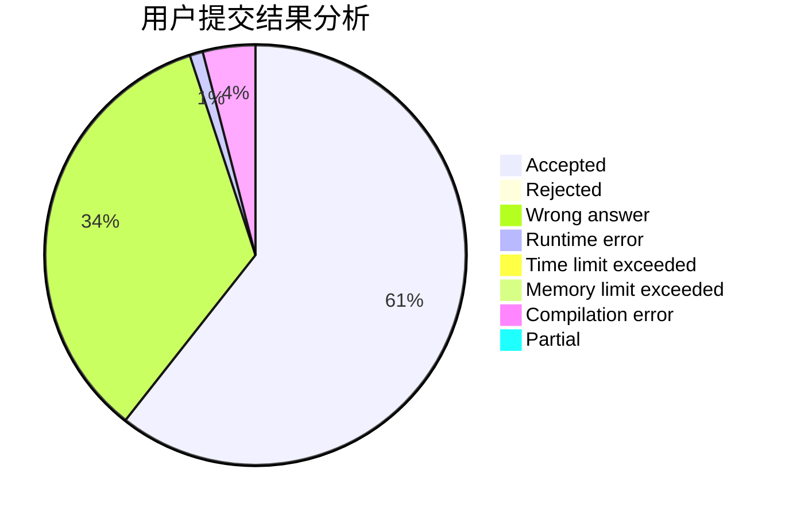
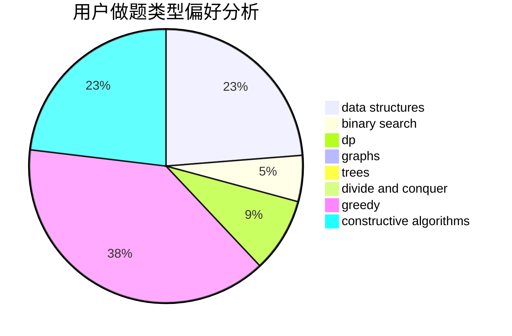
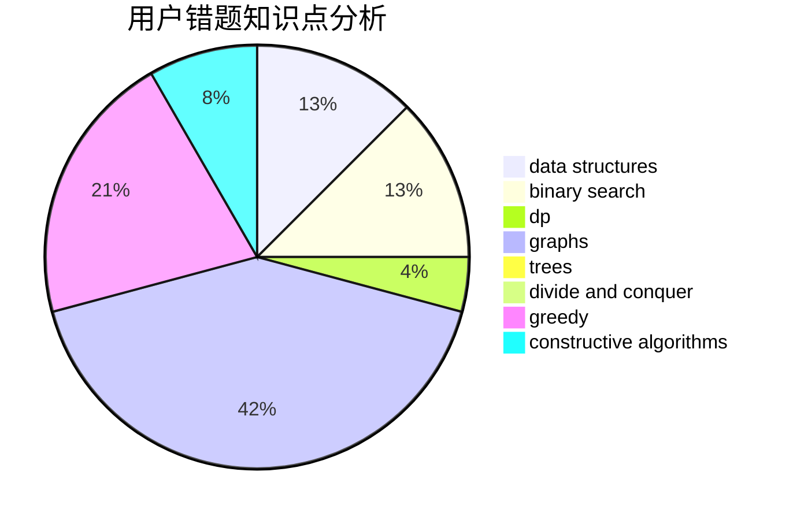

# wllw2011

<!-- tabs:start -->

#### **用户提交结果分析**

#### **用户做题类型偏好分析**

#### **用户错题知识点分析**

<!-- tabs:end -->
# 推荐题目
[543E](https://codeforces.com/contest/543/problem/E)		constructive algorithms,
                        data structures		  
[786D](https://codeforces.com/contest/786/problem/D)		data structures,
                        dfs and similar,
                        hashing,
                        strings,
                        trees		  
[472G](https://codeforces.com/contest/472/problem/G)		bitmasks,
                        data structures,
                        fft		  
[1070H](https://codeforces.com/contest/1070/problem/H)		brute force,
                        implementation		  
[1107C](https://codeforces.com/contest/1107/problem/C)		greedy,
                        sortings,
                        two pointers		  
[975E](https://codeforces.com/contest/975/problem/E)		geometry		  
[518B](https://codeforces.com/contest/518/problem/B)		greedy,
                        implementation,
                        strings		  
[581A](https://codeforces.com/contest/581/problem/A)		implementation,
                        math		  
[983A](https://codeforces.com/contest/983/problem/A)		implementation,
                        math		  
[32B](https://codeforces.com/contest/32/problem/B)		expression parsing,
                        implementation		  
