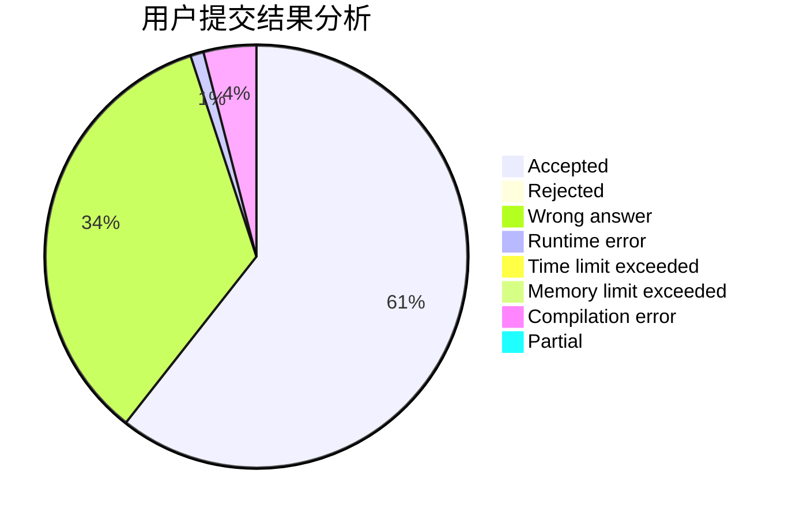
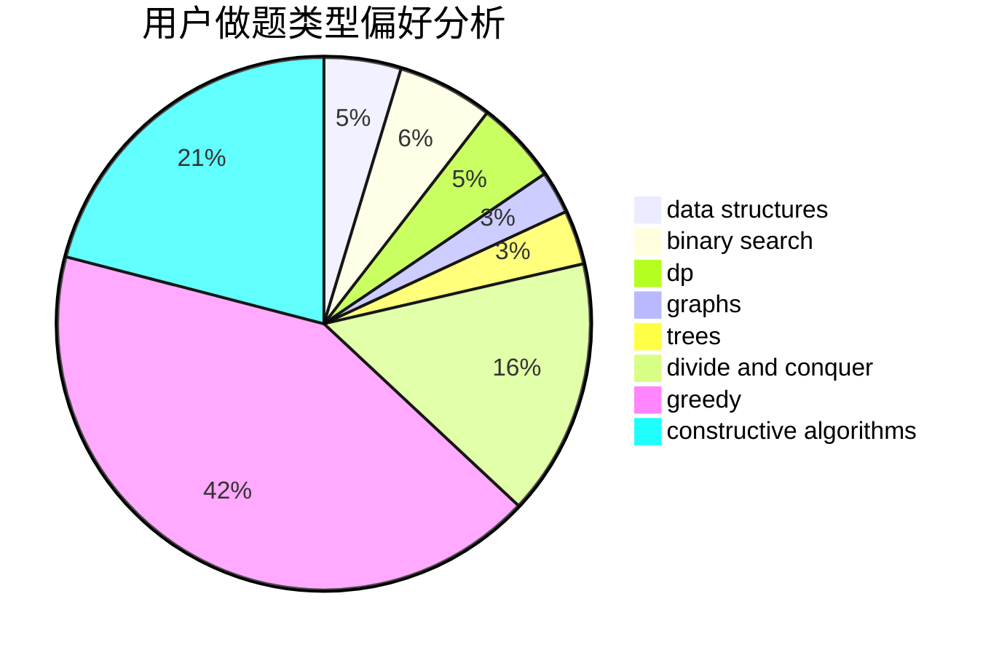
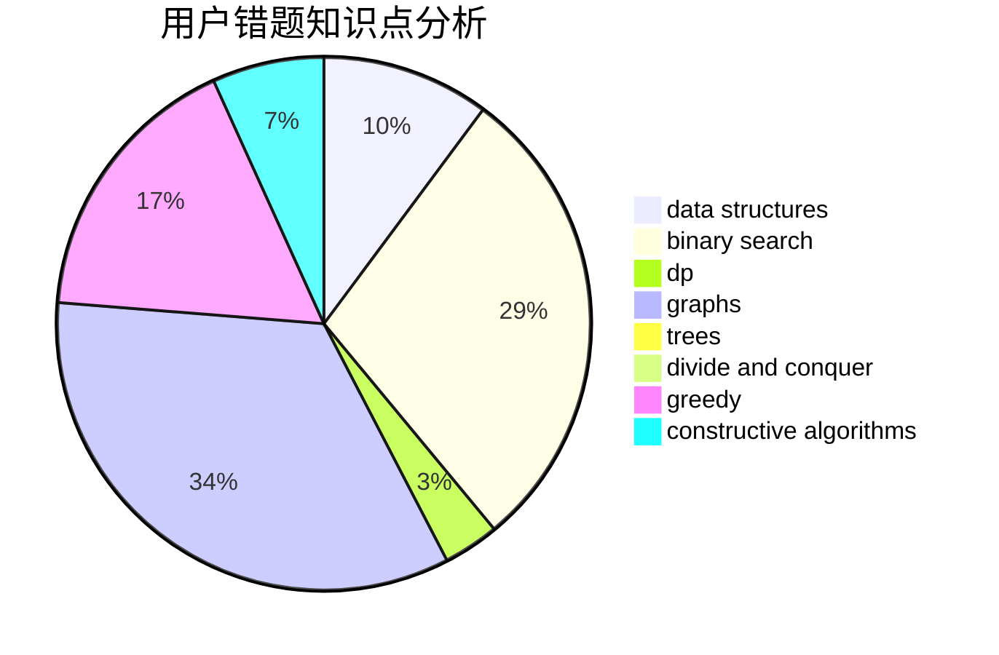

# wllw2011

<!-- tabs:start -->

#### **用户提交结果分析**

#### **用户做题类型偏好分析**

#### **用户错题知识点分析**

<!-- tabs:end -->
# 推荐题目
[516E](https://codeforces.com/contest/516/problem/E)		math,
                        number theory		  
[767B](https://codeforces.com/contest/767/problem/B)		brute force,
                        greedy		  
[451E](https://codeforces.com/contest/451/problem/E)		bitmasks,
                        combinatorics,
                        number theory		  
[1070E](https://codeforces.com/contest/1070/problem/E)		binary search,
                        data structures		  
[1106F](https://codeforces.com/contest/1106/problem/F)		math,
                        matrices,
                        number theory		  
[952F](https://codeforces.com/contest/952/problem/F)		nan		  
[497E](https://codeforces.com/contest/497/problem/E)		dp,
                        matrices		  
[558A](https://codeforces.com/contest/558/problem/A)		brute force,
                        implementation,
                        sortings		  
[960H](https://codeforces.com/contest/960/problem/H)		data structures,
                        trees		  
[309C](https://codeforces.com/contest/309/problem/C)		binary search,
                        bitmasks,
                        greedy		  
