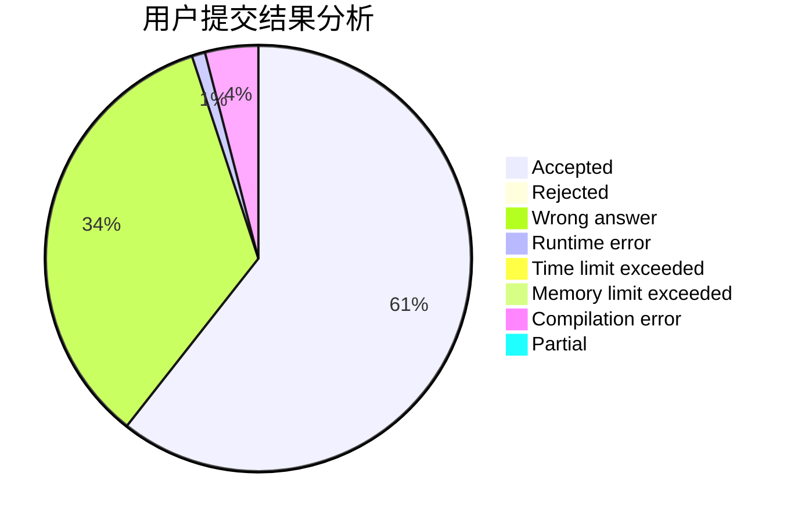
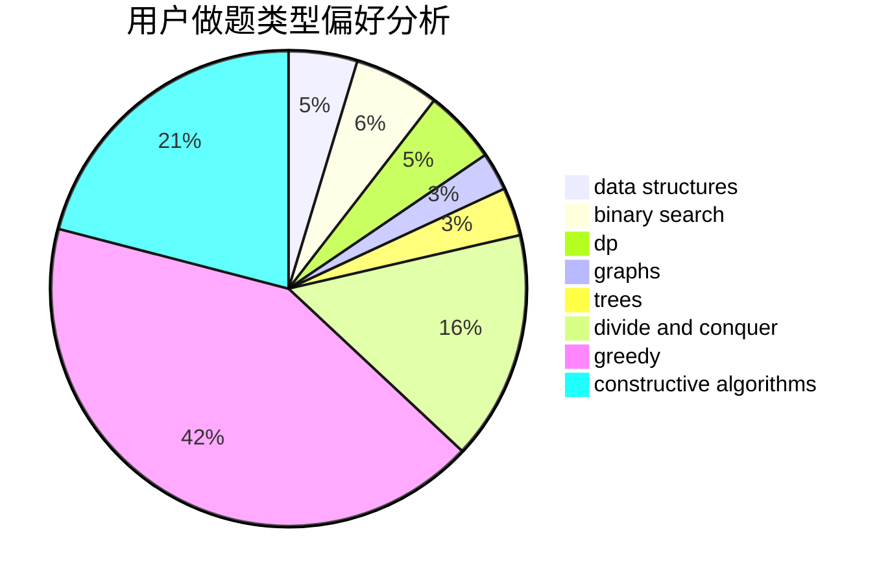
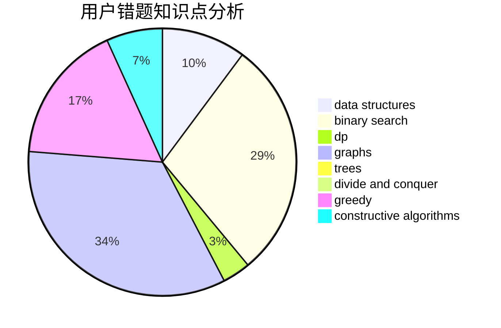

# wllw2011
<!-- tabs:start -->
#### **用户提交结果分析**

#### **用户做题类型偏好分析**

#### **用户错题知识点分析**

<!-- tabs:end -->
# 推荐题目
[Lunar New Year and a Recursive Sequence](http://codeforces.com/problemset/problem/1106/F)		math,
                        matrices,
                        number theory		  
[Devu and Flowers](http://codeforces.com/problemset/problem/451/E)		bitmasks,
                        combinatorics,
                        number theory		  
[Drazil and His Happy Friends](http://codeforces.com/problemset/problem/516/E)		math,
                        number theory		  
[The Queue](http://codeforces.com/problemset/problem/767/B)		brute force,
                        greedy		  
[Getting Deals Done](http://codeforces.com/problemset/problem/1070/E)		binary search,
                        data structures		  
[2 + 2 != 4](http://codeforces.com/problemset/problem/952/F)		nan		  
[Lala Land and Apple Trees](http://codeforces.com/problemset/problem/558/A)		brute force,
                        implementation,
                        sortings		  
[Petya and Strings](http://codeforces.com/problemset/problem/112/A)		implementation,
                        strings		  
[Subsequences Return](http://codeforces.com/problemset/problem/497/E)		dp,
                        matrices		  
[Santa's Gift](http://codeforces.com/problemset/problem/960/H)		data structures,
                        trees		  
<!-- tabs:start -->
#### **data structures**
[Lunar New Year and a Recursive Sequence](http://codeforces.com/problemset/problem/1070/E)		binary search,
                        data structures		  
[Devu and Flowers](http://codeforces.com/problemset/problem/960/H)		data structures,
                        trees		  
[Drazil and His Happy Friends](http://codeforces.com/problemset/problem/622/C)		data structures,
                        implementation		  
[The Queue](https://codeforces.com/contest/1315/problem/D)		data structures,
                        greedy,
                        sortings		  
[Getting Deals Done](http://codeforces.com/problemset/problem/1023/D)		constructive algorithms,
                        data structures		  
[2 + 2 != 4](http://codeforces.com/problemset/problem/1073/D)		binary search,
                        brute force,
                        data structures,
                        greedy		  
[Lala Land and Apple Trees](http://codeforces.com/problemset/problem/725/D)		data structures,
                        greedy		  
[Petya and Strings](http://codeforces.com/problemset/problem/274/E)		data structures,
                        implementation		  
[Subsequences Return](http://codeforces.com/problemset/problem/1340/A)		brute force,
                        data structures,
                        greedy,
                        implementation		  
[Santa's Gift](http://codeforces.com/problemset/problem/1492/C)		binary search,
                        data structures,
                        dp,
                        greedy,
                        two pointers		  
#### **binary search**
[Lunar New Year and a Recursive Sequence](http://codeforces.com/problemset/problem/1070/E)		binary search,
                        data structures		  
[Devu and Flowers](http://codeforces.com/problemset/problem/309/C)		binary search,
                        bitmasks,
                        greedy		  
[Drazil and His Happy Friends](http://codeforces.com/problemset/problem/896/A)		binary search,
                        dfs and similar		  
[The Queue](http://codeforces.com/problemset/problem/830/A)		binary search,
                        brute force,
                        dp,
                        greedy,
                        sortings		  
[Getting Deals Done](http://codeforces.com/problemset/problem/1073/D)		binary search,
                        brute force,
                        data structures,
                        greedy		  
[2 + 2 != 4](http://codeforces.com/problemset/problem/1100/E)		binary search,
                        dfs and similar,
                        graphs		  
[Lala Land and Apple Trees](http://codeforces.com/problemset/problem/785/C)		binary search,
                        math		  
[Petya and Strings](http://codeforces.com/problemset/problem/822/C)		binary search,
                        greedy,
                        implementation,
                        sortings		  
[Subsequences Return](http://codeforces.com/problemset/problem/1492/C)		binary search,
                        data structures,
                        dp,
                        greedy,
                        two pointers		  
[Santa's Gift](http://codeforces.com/problemset/problem/1463/D)		binary search,
                        constructive algorithms,
                        greedy,
                        two pointers		  
#### **dp**
[Lunar New Year and a Recursive Sequence](http://codeforces.com/problemset/problem/497/E)		dp,
                        matrices		  
[Devu and Flowers](http://codeforces.com/problemset/problem/1151/B)		bitmasks,
                        brute force,
                        constructive algorithms,
                        dp		  
[Drazil and His Happy Friends](http://codeforces.com/problemset/problem/830/A)		binary search,
                        brute force,
                        dp,
                        greedy,
                        sortings		  
[The Queue](https://codeforces.com/contest/1058/problem/E)		bitmasks,
                        dp		  
[Getting Deals Done](http://codeforces.com/problemset/problem/316/D1)		brute force,
                        dp		  
[2 + 2 != 4](http://codeforces.com/problemset/problem/1043/F)		bitmasks,
                        combinatorics,
                        dp,
                        math,
                        number theory,
                        shortest paths		  
[Lala Land and Apple Trees](http://codeforces.com/problemset/problem/773/D)		dp,
                        graphs,
                        shortest paths		  
[Petya and Strings](http://codeforces.com/problemset/problem/568/B)		combinatorics,
                        dp,
                        math		  
[Subsequences Return](http://codeforces.com/problemset/problem/1392/D)		dp,
                        greedy		  
[Santa's Gift](http://codeforces.com/problemset/problem/1492/C)		binary search,
                        data structures,
                        dp,
                        greedy,
                        two pointers		  
#### **graph**
[Lunar New Year and a Recursive Sequence](http://codeforces.com/problemset/problem/1100/E)		binary search,
                        dfs and similar,
                        graphs		  
[Devu and Flowers](http://codeforces.com/problemset/problem/901/D)		constructive algorithms,
                        dfs and similar,
                        graphs		  
[Drazil and His Happy Friends](http://codeforces.com/problemset/problem/780/C)		dfs and similar,
                        graphs,
                        greedy,
                        trees		  
[The Queue](http://codeforces.com/problemset/problem/1198/C)		constructive algorithms,
                        graphs,
                        greedy,
                        sortings		  
[Getting Deals Done](http://codeforces.com/problemset/problem/773/D)		dp,
                        graphs,
                        shortest paths		  
[2 + 2 != 4](http://codeforces.com/problemset/problem/1487/C)		brute force,
                        constructive algorithms,
                        dfs and similar,
                        graphs,
                        greedy,
                        implementation,
                        math		  
[Lala Land and Apple Trees](http://codeforces.com/problemset/problem/1437/C)		dp,
                        flows,
                        graph matchings,
                        greedy,
                        math,
                        sortings		  
[Petya and Strings](http://codeforces.com/problemset/problem/1470/D)		constructive algorithms,
                        dfs and similar,
                        graph matchings,
                        graphs,
                        greedy		  
[Subsequences Return](http://codeforces.com/problemset/problem/1476/C)		dp,
                        graphs,
                        greedy		  
[Santa's Gift](http://codeforces.com/problemset/problem/1304/D)		constructive algorithms,
                        graphs,
                        greedy,
                        two pointers		  
#### **trees**
[Lunar New Year and a Recursive Sequence](http://codeforces.com/problemset/problem/960/H)		data structures,
                        trees		  
[Devu and Flowers](http://codeforces.com/problemset/problem/780/C)		dfs and similar,
                        graphs,
                        greedy,
                        trees		  
[Drazil and His Happy Friends](http://codeforces.com/problemset/problem/1479/D)		binary search,
                        bitmasks,
                        brute force,
                        data structures,
                        probabilities,
                        trees		  
[The Queue](http://codeforces.com/problemset/problem/1511/C)		brute force,
                        data structures,
                        implementation,
                        trees		  
[Getting Deals Done](http://codeforces.com/problemset/problem/1499/F)		combinatorics,
                        dfs and similar,
                        dp,
                        trees		  
[2 + 2 != 4](http://codeforces.com/problemset/problem/1491/E)		brute force,
                        dfs and similar,
                        divide and conquer,
                        number theory,
                        trees		  
[Lala Land and Apple Trees](http://codeforces.com/problemset/problem/1466/D)		data structures,
                        greedy,
                        sortings,
                        trees		  
[Petya and Strings](http://codeforces.com/problemset/problem/1495/D)		combinatorics,
                        dfs and similar,
                        graphs,
                        math,
                        shortest paths,
                        trees		  
[Subsequences Return](http://codeforces.com/problemset/problem/1303/G)		data structures,
                        divide and conquer,
                        geometry,
                        trees		  
[Santa's Gift](http://codeforces.com/problemset/problem/1454/E)		combinatorics,
                        dfs and similar,
                        graphs,
                        trees		  
#### **divide and conquer**
[Lunar New Year and a Recursive Sequence](http://codeforces.com/problemset/problem/1461/D)		binary search,
                        brute force,
                        data structures,
                        divide and conquer,
                        implementation,
                        sortings		  
[Devu and Flowers](http://codeforces.com/problemset/problem/1466/G)		combinatorics,
                        divide and conquer,
                        hashing,
                        math,
                        string suffix structures,
                        strings		  
[Drazil and His Happy Friends](http://codeforces.com/problemset/problem/1490/D)		dfs and similar,
                        divide and conquer,
                        implementation		  
[The Queue](https://codeforces.com/contest/1483/problem/C)		data structures,
                        divide and conquer,
                        dp		  
[Getting Deals Done](http://codeforces.com/problemset/problem/1491/E)		brute force,
                        dfs and similar,
                        divide and conquer,
                        number theory,
                        trees		  
[2 + 2 != 4](http://codeforces.com/problemset/problem/1303/G)		data structures,
                        divide and conquer,
                        geometry,
                        trees		  
[Lala Land and Apple Trees](http://codeforces.com/problemset/problem/1494/D)		constructive algorithms,
                        data structures,
                        dfs and similar,
                        divide and conquer,
                        dsu,
                        greedy,
                        sortings,
                        trees		  
[Petya and Strings](http://codeforces.com/problemset/problem/1482/E)		data structures,
                        divide and conquer,
                        dp		  
[Subsequences Return](http://codeforces.com/problemset/problem/566/C)		dfs and similar,
                        divide and conquer,
                        trees		  
[Santa's Gift](http://codeforces.com/problemset/problem/1428/F)		binary search,
                        data structures,
                        divide and conquer,
                        dp,
                        two pointers		  
#### **greedy**
[Lunar New Year and a Recursive Sequence](http://codeforces.com/problemset/problem/767/B)		brute force,
                        greedy		  
[Devu and Flowers](http://codeforces.com/problemset/problem/309/C)		binary search,
                        bitmasks,
                        greedy		  
[Drazil and His Happy Friends](https://codeforces.com/contest/1315/problem/D)		data structures,
                        greedy,
                        sortings		  
[The Queue](http://codeforces.com/problemset/problem/830/A)		binary search,
                        brute force,
                        dp,
                        greedy,
                        sortings		  
[Getting Deals Done](http://codeforces.com/problemset/problem/1073/D)		binary search,
                        brute force,
                        data structures,
                        greedy		  
[2 + 2 != 4](http://codeforces.com/problemset/problem/1097/C)		greedy,
                        implementation		  
[Lala Land and Apple Trees](http://codeforces.com/problemset/problem/1008/B)		greedy,
                        sortings		  
[Petya and Strings](http://codeforces.com/problemset/problem/725/D)		data structures,
                        greedy		  
[Subsequences Return](http://codeforces.com/problemset/problem/1341/B)		greedy,
                        implementation		  
[Santa's Gift](http://codeforces.com/problemset/problem/402/A)		greedy,
                        math		  
#### **constructive algorithms**
[Lunar New Year and a Recursive Sequence](http://codeforces.com/problemset/problem/1151/B)		bitmasks,
                        brute force,
                        constructive algorithms,
                        dp		  
[Devu and Flowers](http://codeforces.com/problemset/problem/1023/D)		constructive algorithms,
                        data structures		  
[Drazil and His Happy Friends](http://codeforces.com/problemset/problem/42/C)		brute force,
                        constructive algorithms		  
[The Queue](http://codeforces.com/problemset/problem/901/D)		constructive algorithms,
                        dfs and similar,
                        graphs		  
[Getting Deals Done](http://codeforces.com/problemset/problem/339/E)		constructive algorithms,
                        dfs and similar,
                        greedy		  
[2 + 2 != 4](http://codeforces.com/problemset/problem/1198/C)		constructive algorithms,
                        graphs,
                        greedy,
                        sortings		  
[Lala Land and Apple Trees](http://codeforces.com/problemset/problem/1221/B)		constructive algorithms,
                        greedy		  
[Petya and Strings](http://codeforces.com/problemset/problem/1493/A)		constructive algorithms,
                        greedy		  
[Subsequences Return](http://codeforces.com/problemset/problem/1463/D)		binary search,
                        constructive algorithms,
                        greedy,
                        two pointers		  
[Santa's Gift](https://codeforces.com/contest/1456/problem/B)		bitmasks,
                        brute force,
                        constructive algorithms		  
#### **sortings**
[Lunar New Year and a Recursive Sequence](http://codeforces.com/problemset/problem/558/A)		brute force,
                        implementation,
                        sortings		  
[Devu and Flowers](http://codeforces.com/problemset/problem/160/C)		implementation,
                        math,
                        sortings		  
[Drazil and His Happy Friends](https://codeforces.com/contest/1315/problem/D)		data structures,
                        greedy,
                        sortings		  
[The Queue](http://codeforces.com/problemset/problem/830/A)		binary search,
                        brute force,
                        dp,
                        greedy,
                        sortings		  
[Getting Deals Done](http://codeforces.com/problemset/problem/1008/B)		greedy,
                        sortings		  
[2 + 2 != 4](http://codeforces.com/problemset/problem/1101/C)		sortings		  
[Lala Land and Apple Trees](http://codeforces.com/problemset/problem/1198/C)		constructive algorithms,
                        graphs,
                        greedy,
                        sortings		  
[Petya and Strings](http://codeforces.com/problemset/problem/822/C)		binary search,
                        greedy,
                        implementation,
                        sortings		  
[Subsequences Return](http://codeforces.com/problemset/problem/984/A)		sortings		  
[Santa's Gift](https://codeforces.com/contest/1496/problem/C)		geometry,
                        greedy,
                        math,
                        sortings		  
<!-- tabs:end -->
