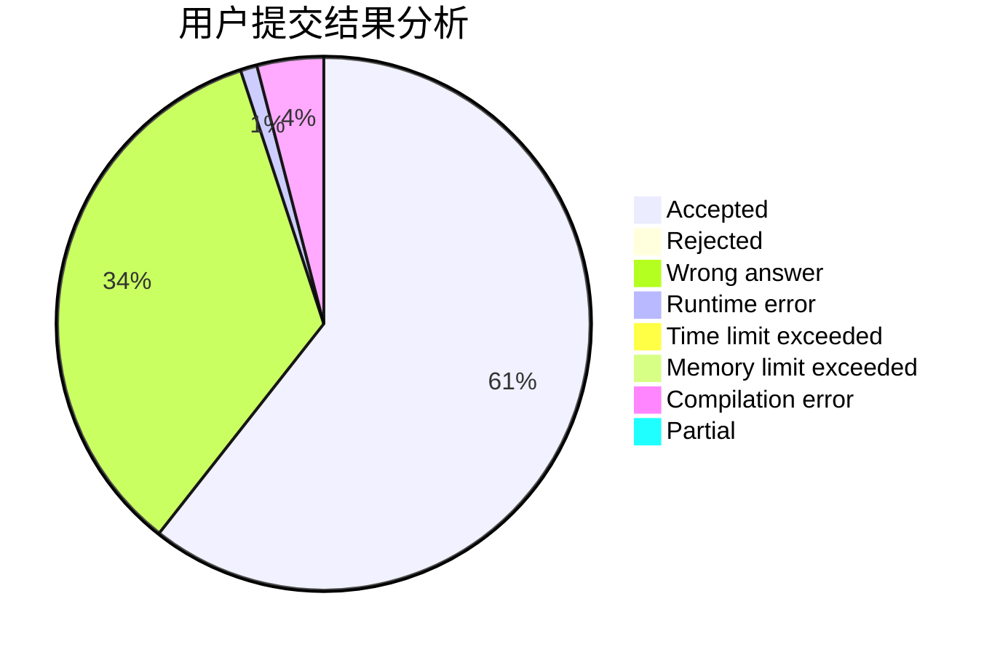
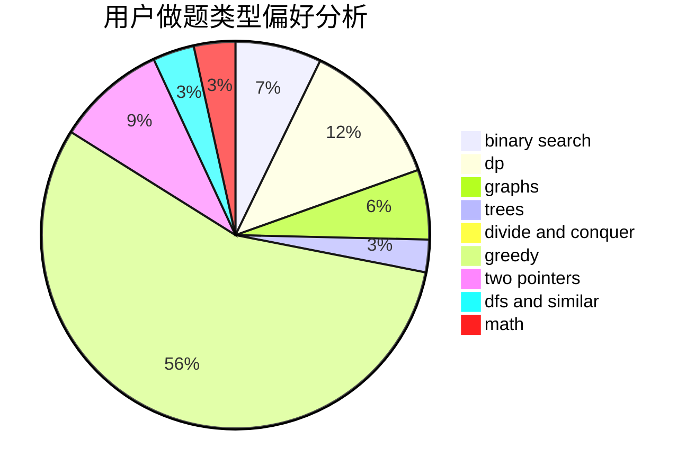

# wllw2011

<!-- tabs:start -->

#### **用户提交结果分析**

#### **用户做题类型偏好分析**

<!-- tabs:end -->
# 推荐题目
[543E](https://codeforces.com/contest/543/problem/E)
[786D](https://codeforces.com/contest/786/problem/D)
[472G](https://codeforces.com/contest/472/problem/G)
[1070H](https://codeforces.com/contest/1070/problem/H)
[1107C](https://codeforces.com/contest/1107/problem/C)
[975E](https://codeforces.com/contest/975/problem/E)
[518B](https://codeforces.com/contest/518/problem/B)
[581A](https://codeforces.com/contest/581/problem/A)
[983A](https://codeforces.com/contest/983/problem/A)
[32B](https://codeforces.com/contest/32/problem/B)
