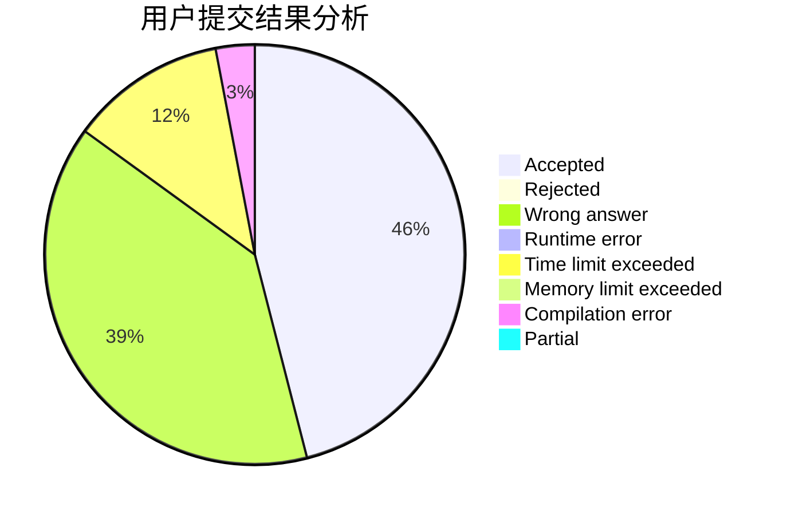
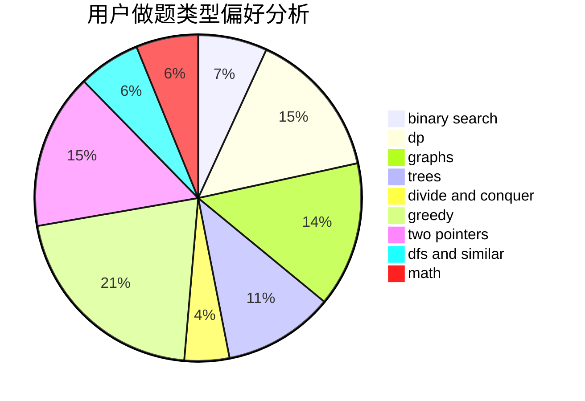

# wlzhouzhuan

<!-- tabs:start -->

#### **用户提交结果分析**

#### **用户做题类型偏好分析**

<!-- tabs:end -->
# 推荐题目
[1028G](https://codeforces.com/contest/1028/problem/G)
[1360H](https://codeforces.com/contest/1360/problem/H)
[319B](https://codeforces.com/contest/319/problem/B)
[962F](https://codeforces.com/contest/962/problem/F)
[732A](https://codeforces.com/contest/732/problem/A)
[1422D](https://codeforces.com/contest/1422/problem/D)
[821A](https://codeforces.com/contest/821/problem/A)
[998C](https://codeforces.com/contest/998/problem/C)
[1030D](https://codeforces.com/contest/1030/problem/D)
[988D](https://codeforces.com/contest/988/problem/D)
