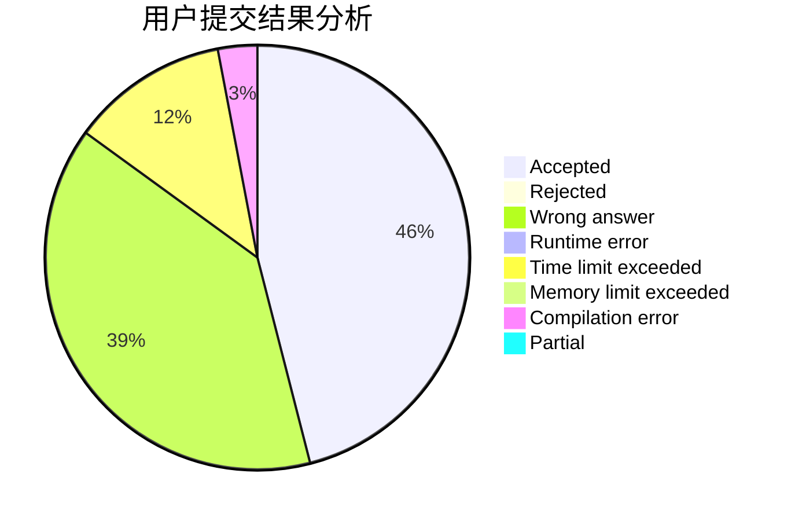
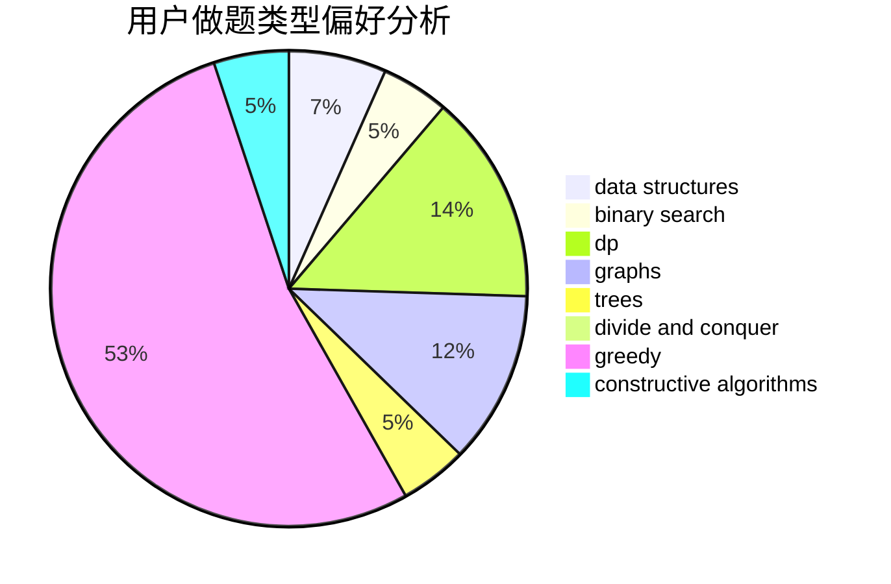
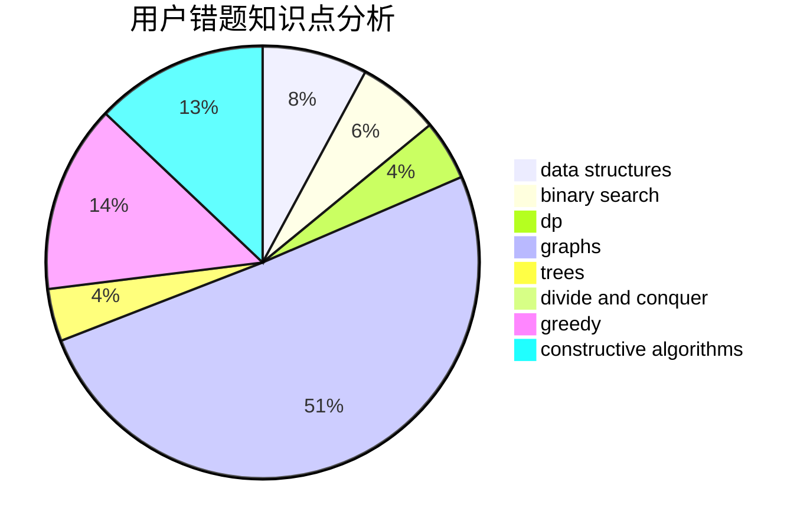

# wlzhouzhuan

<!-- tabs:start -->

#### **用户提交结果分析**

#### **用户做题类型偏好分析**

#### **用户错题知识点分析**

<!-- tabs:end -->
# 推荐题目
[1028C](https://codeforces.com/contest/1028/problem/C)		geometry,
                        implementation,
                        sortings		  
[1354C2](https://codeforces.com/contest/1354C/problem/2)		binary search,
                        brute force,
                        geometry,
                        math		  
[300D](https://codeforces.com/contest/300/problem/D)		dp,
                        fft		  
[946B](https://codeforces.com/contest/946/problem/B)		math,
                        number theory		  
[712E](https://codeforces.com/contest/712/problem/E)		data structures,
                        math,
                        probabilities		  
[1413B](https://codeforces.com/contest/1413/problem/B)		implementation		  
[804F](https://codeforces.com/contest/804/problem/F)		combinatorics,
                        dfs and similar,
                        dp,
                        graphs,
                        number theory		  
[982E](https://codeforces.com/contest/982/problem/E)		geometry,
                        number theory		  
[1030A](https://codeforces.com/contest/1030/problem/A)		implementation		  
[967A](https://codeforces.com/contest/967/problem/A)		implementation		  
