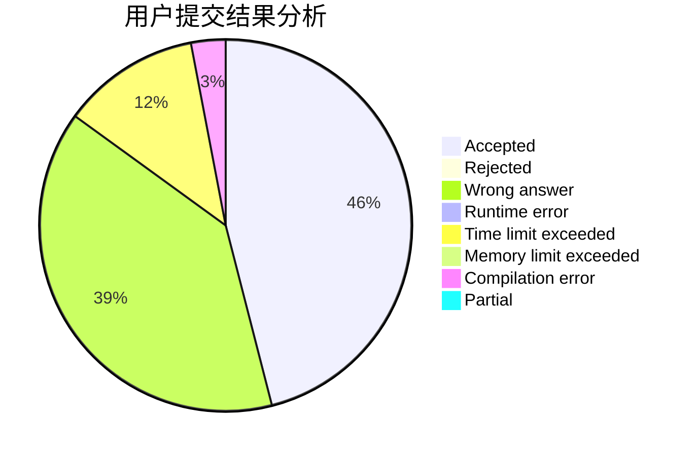
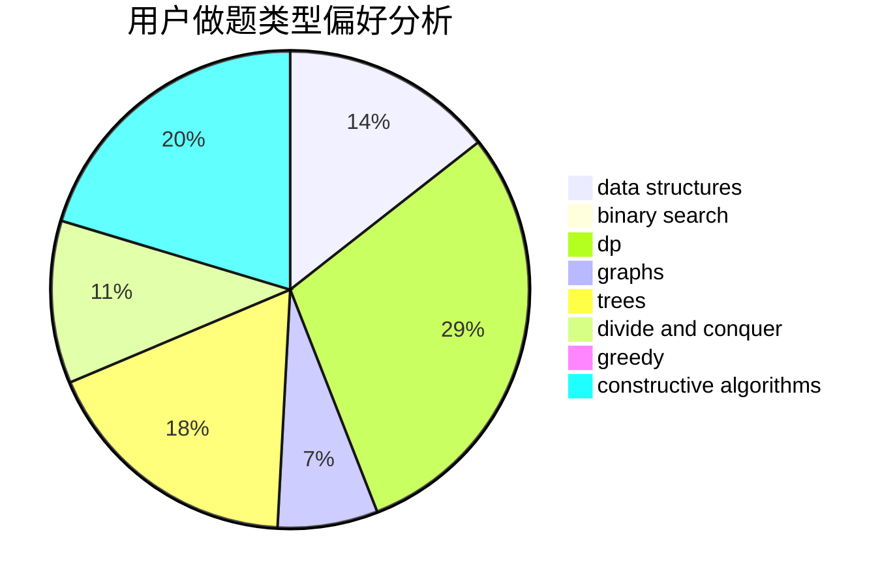
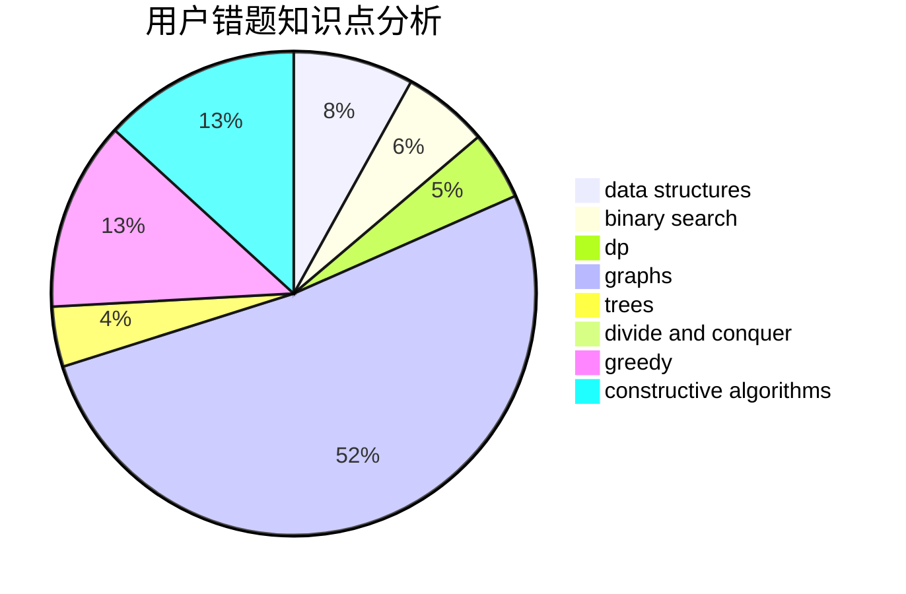

# wlzhouzhuan

<!-- tabs:start -->

#### **用户提交结果分析**

#### **用户做题类型偏好分析**

#### **用户错题知识点分析**

<!-- tabs:end -->
# 推荐题目
[1028G](https://codeforces.com/contest/1028/problem/G)		dp,
                        interactive		  
[1360H](https://codeforces.com/contest/1360/problem/H)		binary search,
                        bitmasks,
                        brute force,
                        constructive algorithms		  
[319B](https://codeforces.com/contest/319/problem/B)		data structures,
                        implementation		  
[962F](https://codeforces.com/contest/962/problem/F)		dfs and similar,
                        graphs,
                        trees		  
[732A](https://codeforces.com/contest/732/problem/A)		brute force,
                        constructive algorithms,
                        implementation,
                        math		  
[1422D](https://codeforces.com/contest/1422/problem/D)		graphs,
                        shortest paths,
                        sortings		  
[821A](https://codeforces.com/contest/821/problem/A)		implementation		  
[998C](https://codeforces.com/contest/998/problem/C)		dsu,graphs,sortings,trees		  
[1030D](https://codeforces.com/contest/1030/problem/D)		geometry,
                        number theory		  
[988D](https://codeforces.com/contest/988/problem/D)		brute force,
                        math		  
