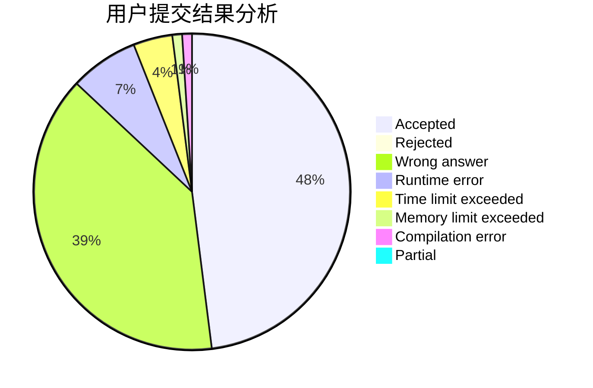
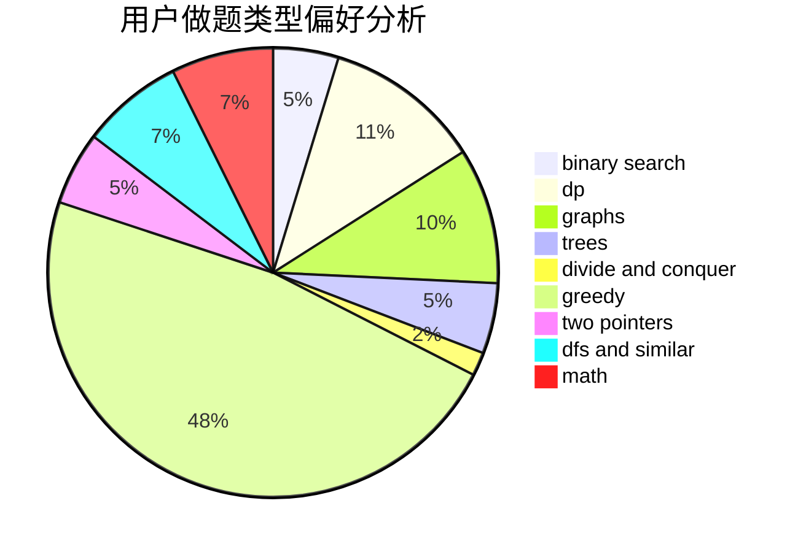

# wlzs

<!-- tabs:start -->

#### **用户提交结果分析**

#### **用户做题类型偏好分析**

<!-- tabs:end -->
# 推荐题目
[51A](https://codeforces.com/contest/51/problem/A)
[1187E](https://codeforces.com/contest/1187/problem/E)
[573C](https://codeforces.com/contest/573/problem/C)
[651B](https://codeforces.com/contest/651/problem/B)
[26B](https://codeforces.com/contest/26/problem/B)
[801B](https://codeforces.com/contest/801/problem/B)
[1349D](https://codeforces.com/contest/1349/problem/D)
[1131E](https://codeforces.com/contest/1131/problem/E)
[890A](https://codeforces.com/contest/890/problem/A)
[429E](https://codeforces.com/contest/429/problem/E)
