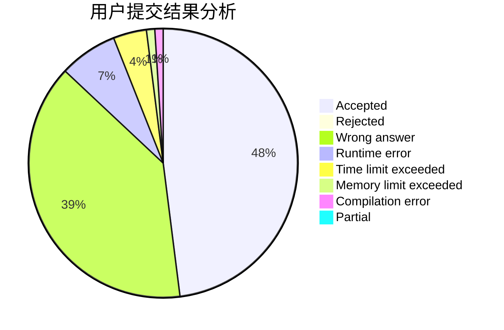
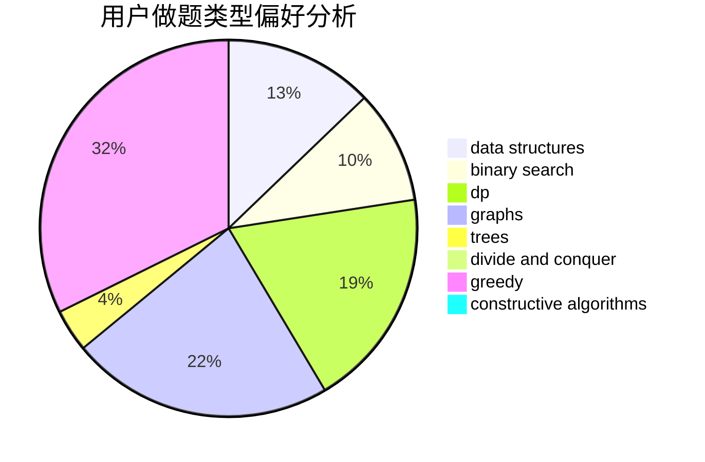

# wlzs

<!-- tabs:start -->

#### **用户提交结果分析**

#### **用户做题类型偏好分析**

#### **用户错题知识点分析**

<!-- tabs:end -->
# 推荐题目
[51A](https://codeforces.com/contest/51/problem/A)		implementation		  
[1187E](https://codeforces.com/contest/1187/problem/E)		dfs and similar,
                        dp,
                        trees		  
[573C](https://codeforces.com/contest/573/problem/C)		constructive algorithms,
                        dfs and similar,
                        trees		  
[651B](https://codeforces.com/contest/651/problem/B)		greedy,
                        sortings		  
[26B](https://codeforces.com/contest/26/problem/B)		greedy		  
[801B](https://codeforces.com/contest/801/problem/B)		constructive algorithms,
                        greedy,
                        strings		  
[1349D](https://codeforces.com/contest/1349/problem/D)		math,
                        probabilities		  
[1131E](https://codeforces.com/contest/1131/problem/E)		dp,
                        greedy,
                        strings		  
[890A](https://codeforces.com/contest/890/problem/A)		dsu,graphs,sortings,trees		  
[429E](https://codeforces.com/contest/429/problem/E)		graphs		  
