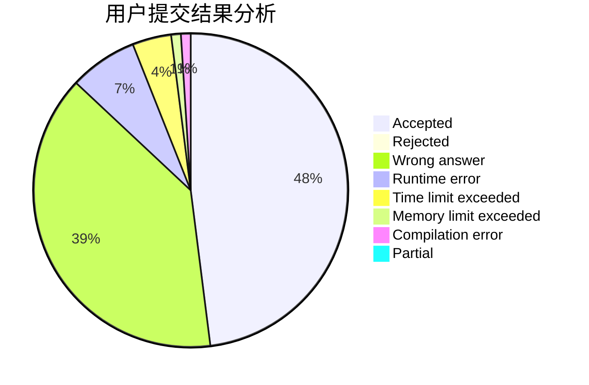
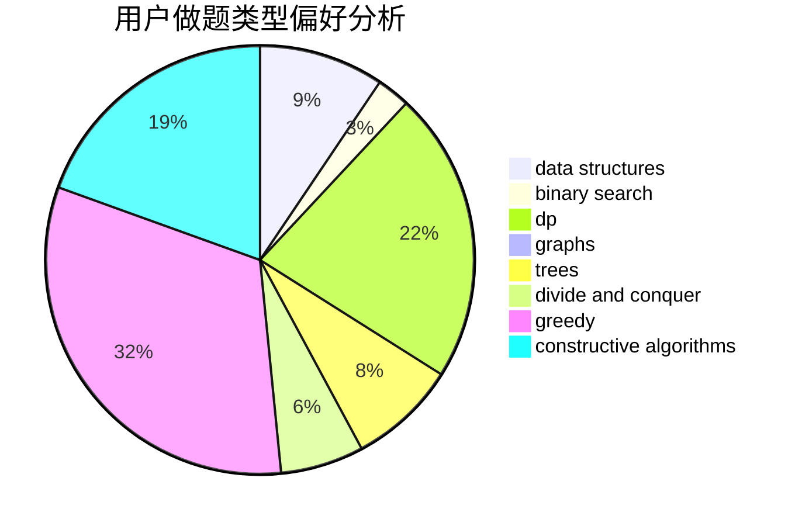

# wlzs

<!-- tabs:start -->

#### **用户提交结果分析**

#### **用户做题类型偏好分析**

#### **用户错题知识点分析**

<!-- tabs:end -->
# 推荐题目
[499C](https://codeforces.com/contest/499/problem/C)		dsu,graphs,sortings,trees		  
[1184B2](https://codeforces.com/contest/1184B/problem/2)		flows,
                        graph matchings,
                        graphs,
                        shortest paths,
                        sortings		  
[548A](https://codeforces.com/contest/548/problem/A)		brute force,
                        implementation,
                        strings		  
[623B](https://codeforces.com/contest/623/problem/B)		dp,
                        greedy,
                        number theory		  
[252A](https://codeforces.com/contest/252/problem/A)		brute force,
                        implementation		  
[784B](https://codeforces.com/contest/784/problem/B)		*special problem		  
[1342F](https://codeforces.com/contest/1342/problem/F)		bitmasks,
                        brute force,
                        dp		  
[1129E](https://codeforces.com/contest/1129/problem/E)		binary search,
                        interactive,
                        trees		  
[86D](https://codeforces.com/contest/86/problem/D)		data structures,
                        implementation,
                        math,
                        two pointers		  
[3D](https://codeforces.com/contest/3/problem/D)		greedy		  
