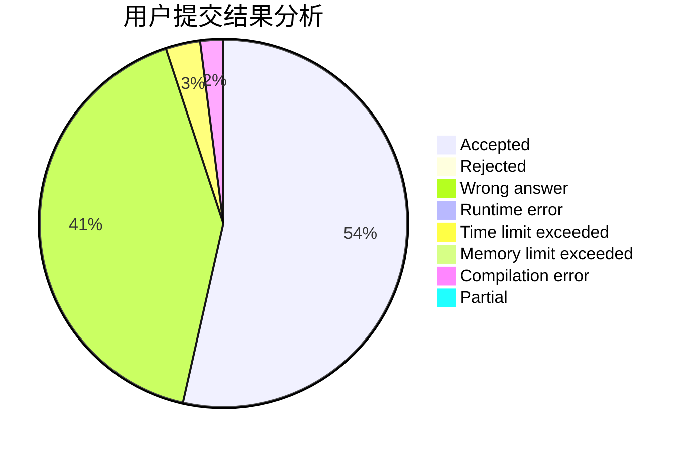
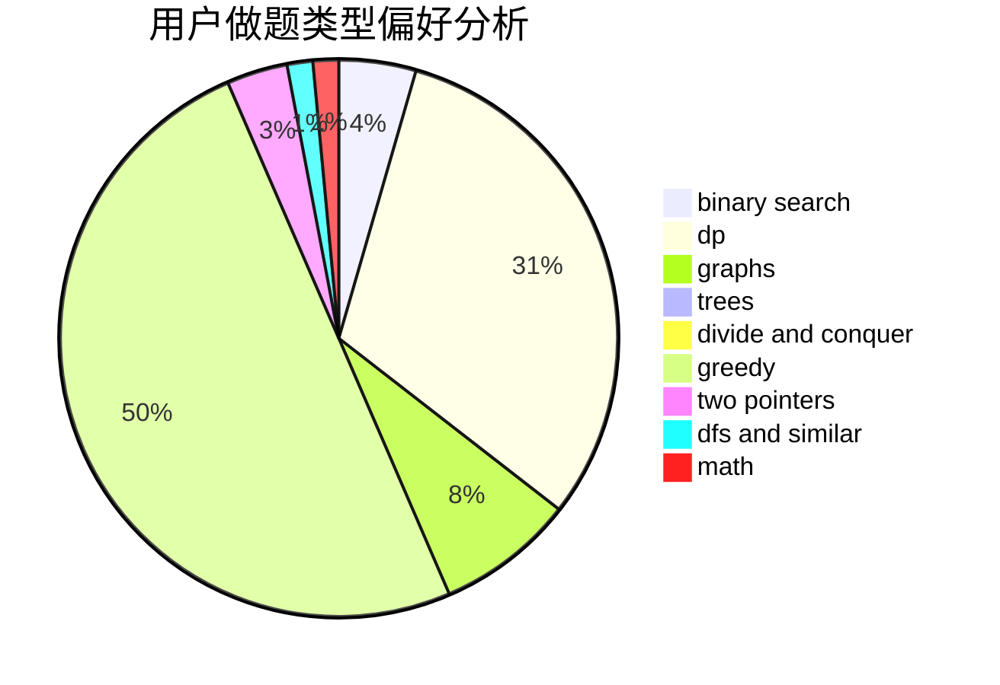

# wmxwmx

<!-- tabs:start -->

#### **用户提交结果分析**

#### **用户做题类型偏好分析**

<!-- tabs:end -->
# 推荐题目
[548A](https://codeforces.com/contest/548/problem/A)
[1470E](https://codeforces.com/contest/1470/problem/E)
[985E](https://codeforces.com/contest/985/problem/E)
[548B](https://codeforces.com/contest/548/problem/B)
[551B](https://codeforces.com/contest/551/problem/B)
[208A](https://codeforces.com/contest/208/problem/A)
[1210D](https://codeforces.com/contest/1210/problem/D)
[993C](https://codeforces.com/contest/993/problem/C)
[166A](https://codeforces.com/contest/166/problem/A)
[768E](https://codeforces.com/contest/768/problem/E)
