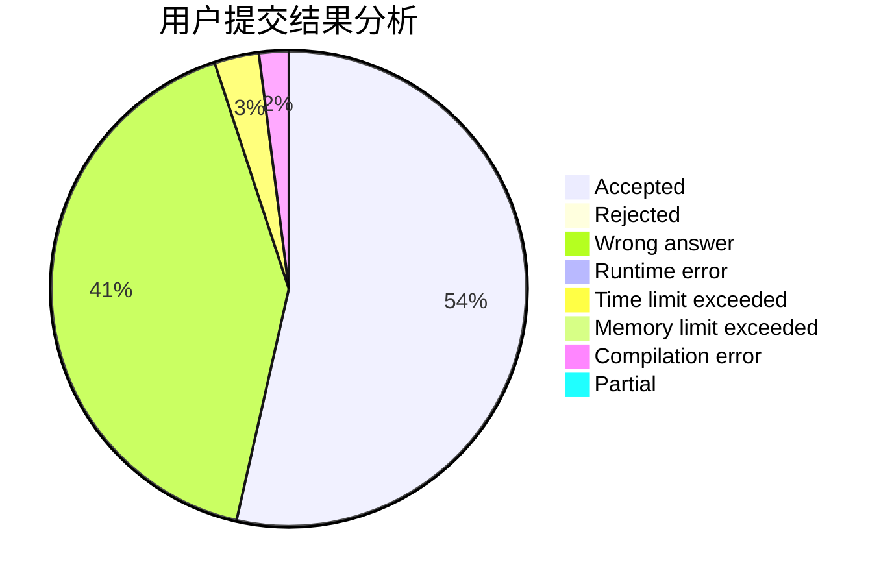
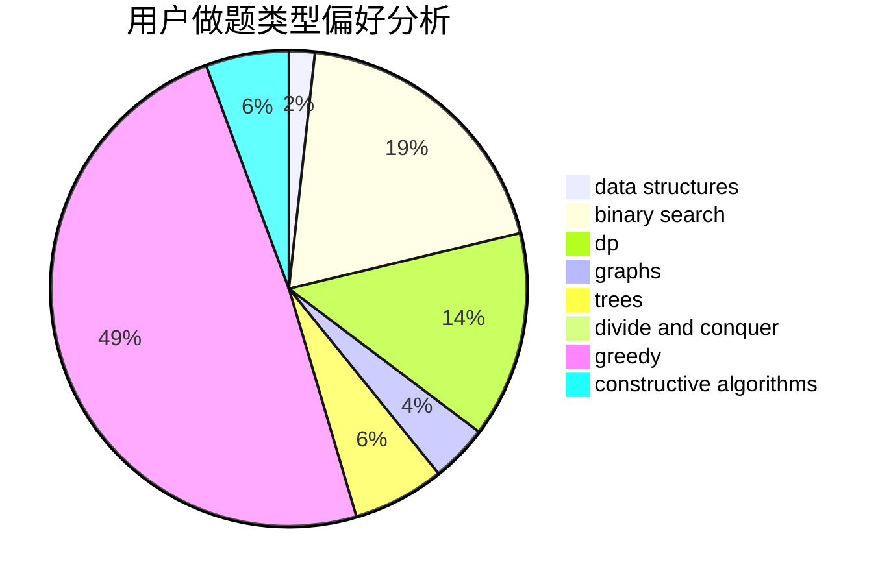
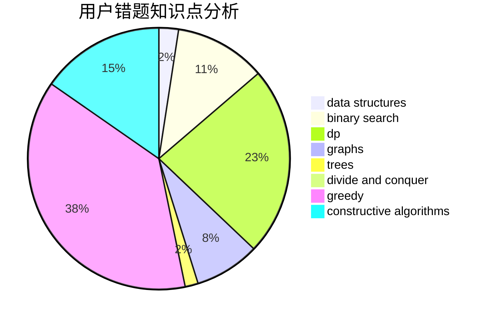

# wmxwmx

<!-- tabs:start -->

#### **用户提交结果分析**

#### **用户做题类型偏好分析**

#### **用户错题知识点分析**

<!-- tabs:end -->
# 推荐题目
[522D](https://codeforces.com/contest/522/problem/D)		*special problem,
                        data structures		  
[1463D](https://codeforces.com/contest/1463/problem/D)		binary search,
                        constructive algorithms,
                        greedy,
                        two pointers		  
[962G](https://codeforces.com/contest/962/problem/G)		data structures,
                        dsu,
                        geometry,
                        trees		  
[523A](https://codeforces.com/contest/523/problem/A)		*special problem,
                        implementation		  
[527B](https://codeforces.com/contest/527/problem/B)		greedy		  
[180D](https://codeforces.com/contest/180/problem/D)		greedy,
                        strings		  
[1206C](https://codeforces.com/contest/1206/problem/C)		dsu,graphs,sortings,trees		  
[979C](https://codeforces.com/contest/979/problem/C)		dfs and similar,
                        trees		  
[1510I](https://codeforces.com/contest/1510/problem/I)		greedy,
                        interactive,
                        math,
                        probabilities		  
[749E](https://codeforces.com/contest/749/problem/E)		data structures,
                        probabilities		  
