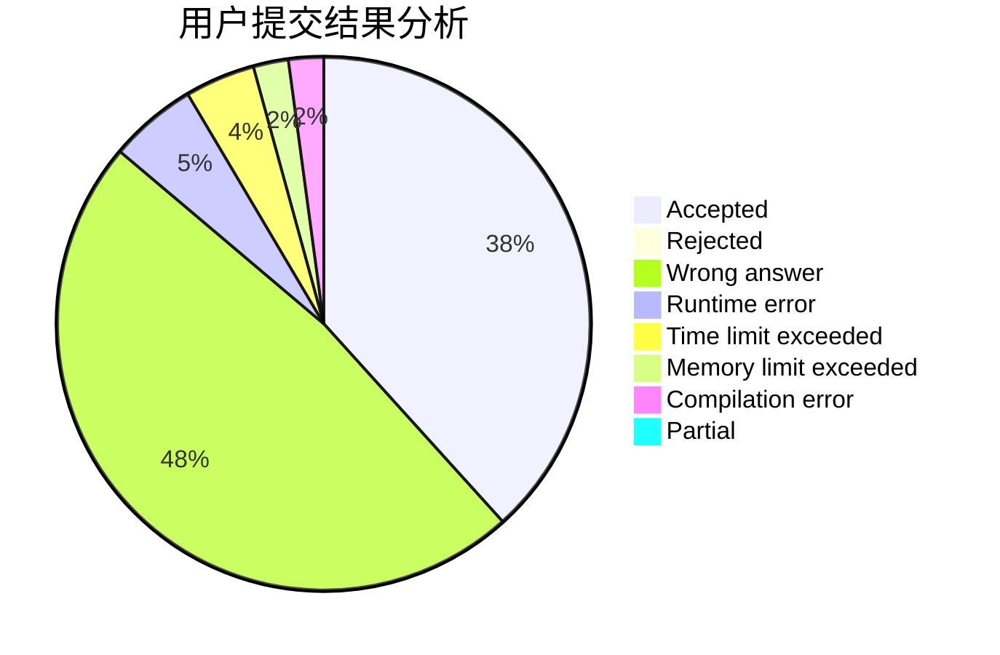
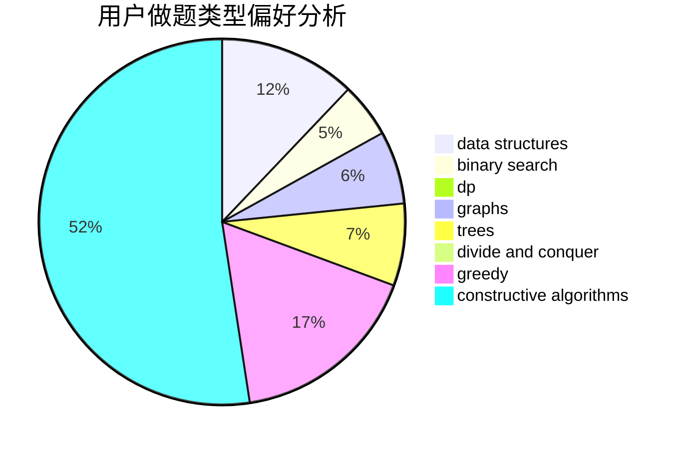
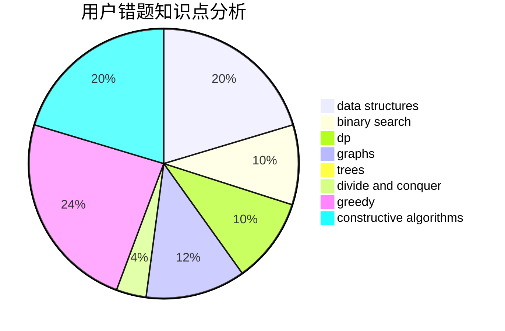

# wondover

<!-- tabs:start -->

#### **用户提交结果分析**

#### **用户做题类型偏好分析**

#### **用户错题知识点分析**

<!-- tabs:end -->
# 推荐题目
[1283F](https://codeforces.com/contest/1283/problem/F)		constructive algorithms,
                        greedy,
                        trees		  
[1285E](https://codeforces.com/contest/1285/problem/E)		brute force,
                        constructive algorithms,
                        data structures,
                        dp,
                        graphs,
                        sortings,
                        trees,
                        two pointers		  
[1389C](https://codeforces.com/contest/1389/problem/C)		brute force,
                        dp,
                        greedy,
                        two pointers		  
[316E2](https://codeforces.com/contest/316E/problem/2)		data structures,
                        math		  
[283A](https://codeforces.com/contest/283/problem/A)		constructive algorithms,
                        data structures,
                        implementation		  
[7D](https://codeforces.com/contest/7/problem/D)		hashing,
                        strings		  
[1132A](https://codeforces.com/contest/1132/problem/A)		greedy,
                        implementation		  
[226B](https://codeforces.com/contest/226/problem/B)		greedy		  
[949B](https://codeforces.com/contest/949/problem/B)		constructive algorithms,
                        math		  
[659A](https://codeforces.com/contest/659/problem/A)		implementation,
                        math		  
