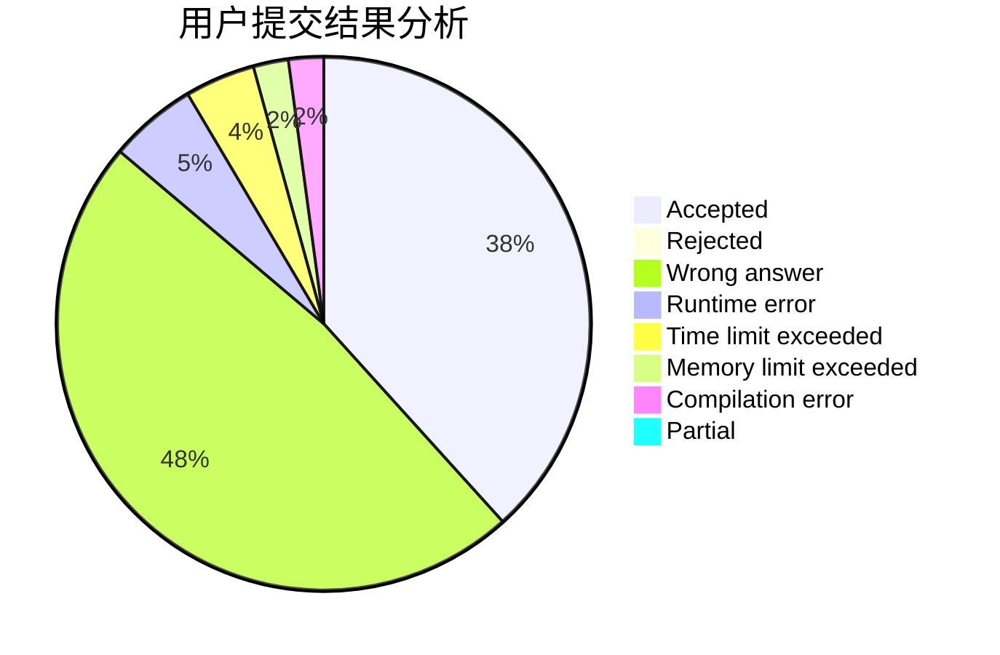
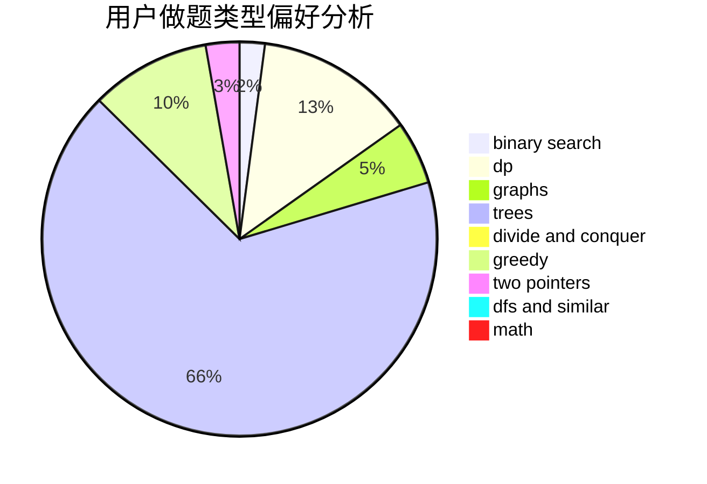

# wondover

<!-- tabs:start -->

#### **用户提交结果分析**

#### **用户做题类型偏好分析**

<!-- tabs:end -->
# 推荐题目
[1290F](https://codeforces.com/contest/1290/problem/F)
[1292F](https://codeforces.com/contest/1292/problem/F)
[1398F](https://codeforces.com/contest/1398/problem/F)
[343A](https://codeforces.com/contest/343/problem/A)
[29A](https://codeforces.com/contest/29/problem/A)
[814E](https://codeforces.com/contest/814/problem/E)
[1133E](https://codeforces.com/contest/1133/problem/E)
[245A](https://codeforces.com/contest/245/problem/A)
[966A](https://codeforces.com/contest/966/problem/A)
[679A](https://codeforces.com/contest/679/problem/A)
