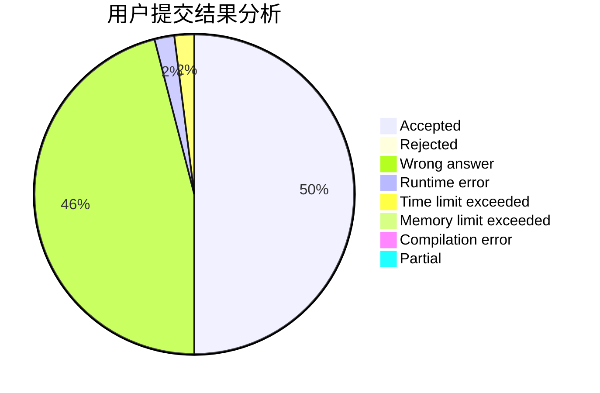
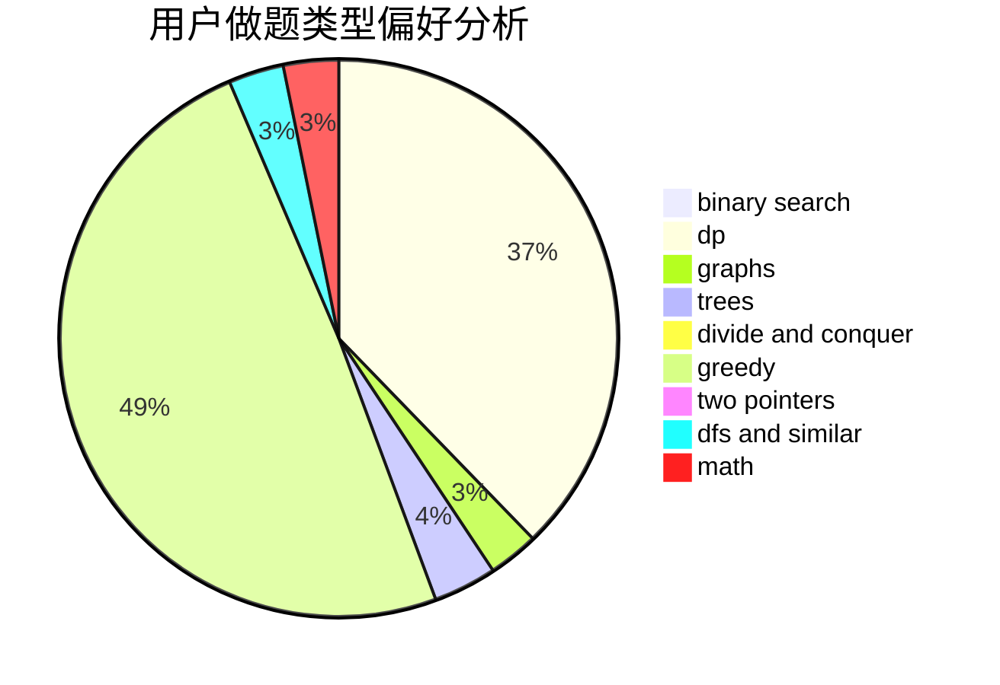

# worcher

<!-- tabs:start -->

#### **用户提交结果分析**

#### **用户做题类型偏好分析**

<!-- tabs:end -->
# 推荐题目
[1461A](https://codeforces.com/contest/1461/problem/A)
[722D](https://codeforces.com/contest/722/problem/D)
[1260F](https://codeforces.com/contest/1260/problem/F)
[1155A](https://codeforces.com/contest/1155/problem/A)
[535A](https://codeforces.com/contest/535/problem/A)
[1210C](https://codeforces.com/contest/1210/problem/C)
[275B](https://codeforces.com/contest/275/problem/B)
[21C](https://codeforces.com/contest/21/problem/C)
[352A](https://codeforces.com/contest/352/problem/A)
[525C](https://codeforces.com/contest/525/problem/C)
