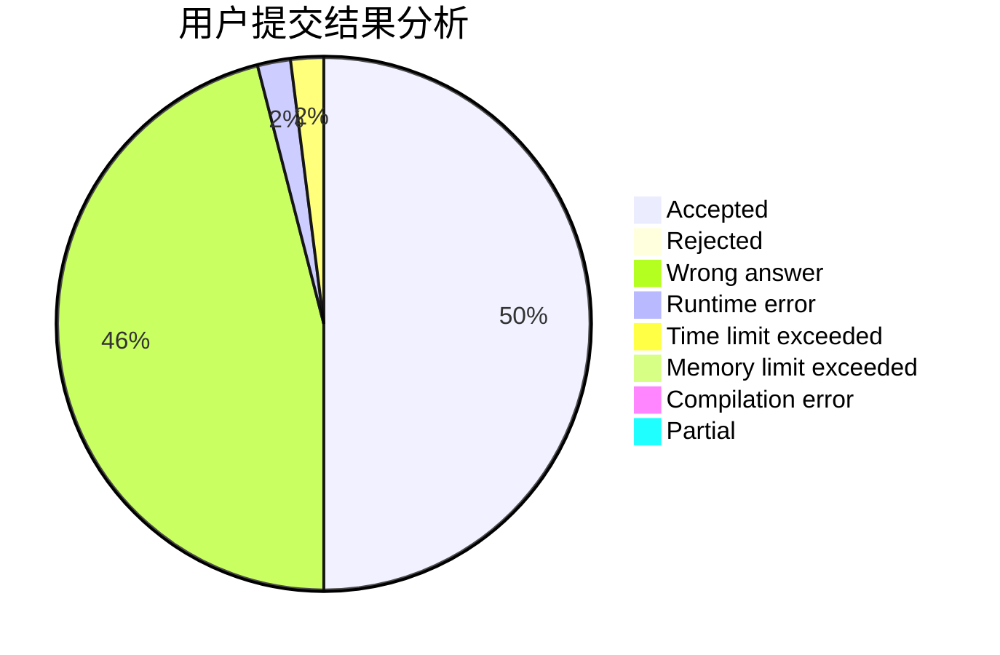
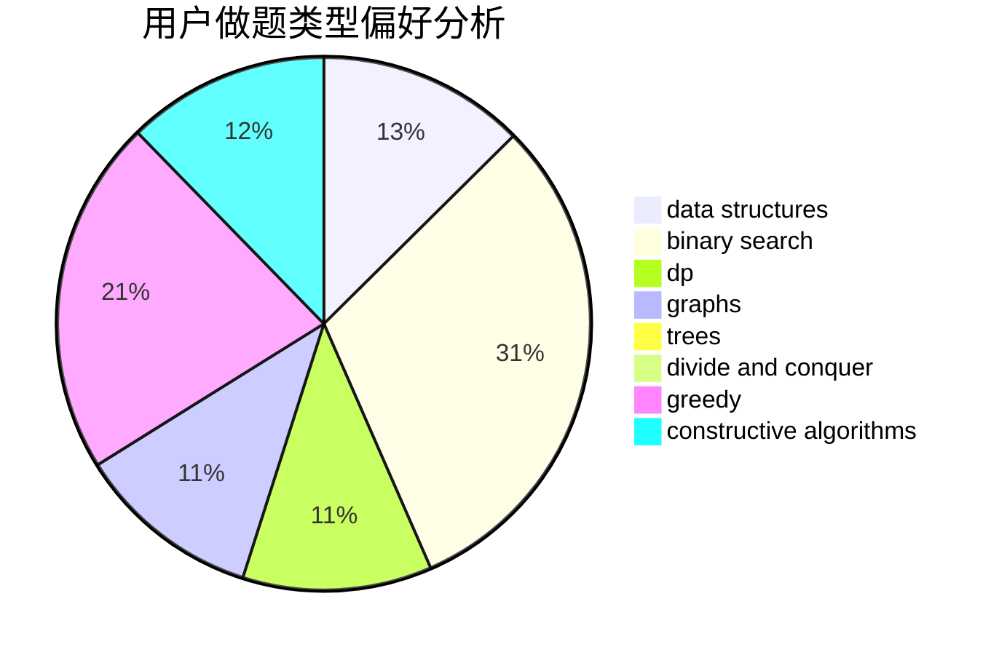
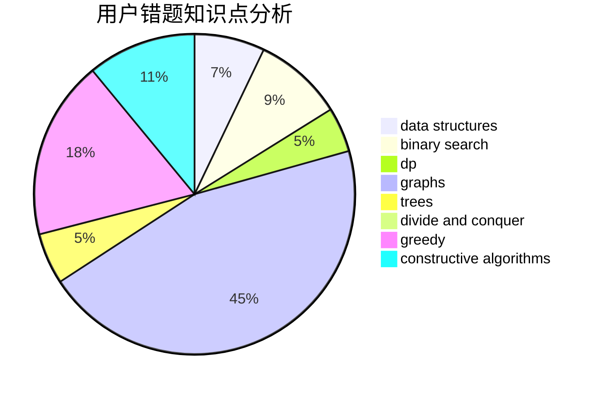

# worcher

<!-- tabs:start -->

#### **用户提交结果分析**

#### **用户做题类型偏好分析**

#### **用户错题知识点分析**

<!-- tabs:end -->
# 推荐题目
[1451E1](https://codeforces.com/contest/1451E/problem/1)		bitmasks,
                        constructive algorithms,
                        interactive,
                        math		  
[703C](https://codeforces.com/contest/703/problem/C)		geometry,
                        implementation		  
[1253D](https://codeforces.com/contest/1253/problem/D)		constructive algorithms,
                        dfs and similar,
                        dsu,
                        graphs,
                        greedy,
                        sortings		  
[1153A](https://codeforces.com/contest/1153/problem/A)		brute force,
                        math		  
[512A](https://codeforces.com/contest/512/problem/A)		dsu,graphs,sortings,trees		  
[1206B](https://codeforces.com/contest/1206/problem/B)		dp,
                        implementation		  
[258C](https://codeforces.com/contest/258/problem/C)		binary search,
                        combinatorics,
                        dp,
                        math		  
[198C](https://codeforces.com/contest/198/problem/C)		binary search,
                        geometry		  
[321B](https://codeforces.com/contest/321/problem/B)		dp,
                        flows,
                        greedy		  
[505A](https://codeforces.com/contest/505/problem/A)		brute force,
                        implementation,
                        strings		  
