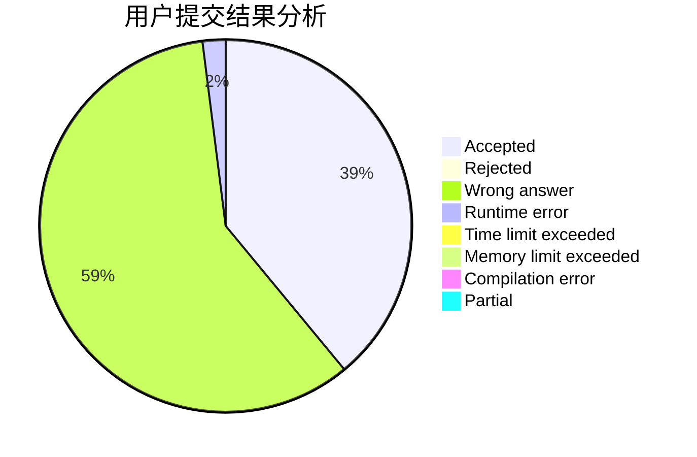
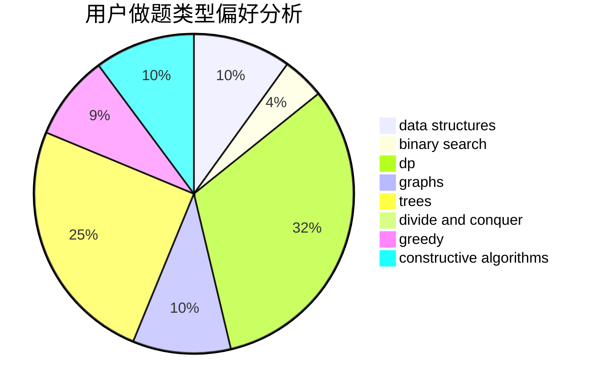
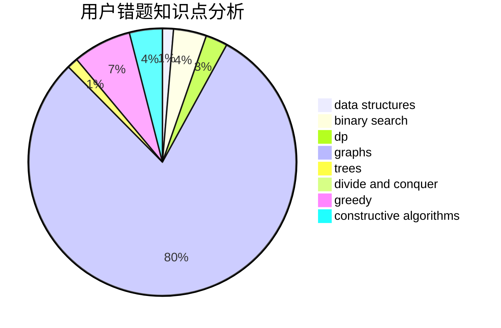

# work_hard.

<!-- tabs:start -->

#### **用户提交结果分析**

#### **用户做题类型偏好分析**

#### **用户错题知识点分析**

<!-- tabs:end -->
# 推荐题目
[817A](https://codeforces.com/contest/817/problem/A)		implementation,
                        math,
                        number theory		  
[691D](https://codeforces.com/contest/691/problem/D)		dfs and similar,
                        dsu,
                        math		  
[1188E](https://codeforces.com/contest/1188/problem/E)		combinatorics		  
[12131](https://codeforces.com/contest/1213/problem/1)		dsu,graphs,sortings,trees		  
[938E](https://codeforces.com/contest/938/problem/E)		combinatorics,
                        math		  
[1411F](https://codeforces.com/contest/1411/problem/F)		greedy,
                        math		  
[418D](https://codeforces.com/contest/418/problem/D)		data structures,
                        graphs,
                        trees		  
[1281F](https://codeforces.com/contest/1281/problem/F)		dsu,graphs,sortings,trees		  
[288D](https://codeforces.com/contest/288/problem/D)		combinatorics,
                        dfs and similar,
                        trees		  
[1070F](https://codeforces.com/contest/1070/problem/F)		greedy		  
