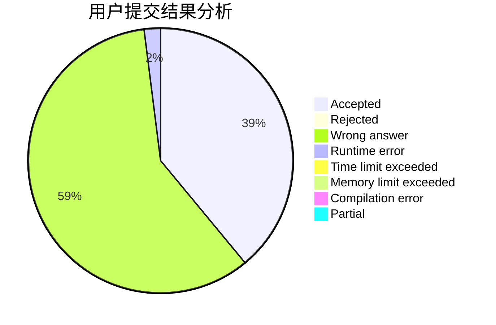
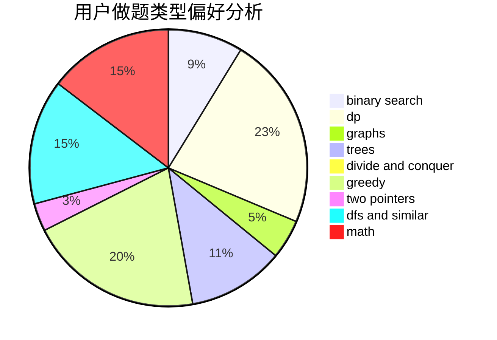

# work_hard.

<!-- tabs:start -->

#### **用户提交结果分析**

#### **用户做题类型偏好分析**

<!-- tabs:end -->
# 推荐题目
[817A](https://codeforces.com/contest/817/problem/A)
[691D](https://codeforces.com/contest/691/problem/D)
[1188E](https://codeforces.com/contest/1188/problem/E)
[12131](https://codeforces.com/contest/1213/problem/1)
[938E](https://codeforces.com/contest/938/problem/E)
[1411F](https://codeforces.com/contest/1411/problem/F)
[418D](https://codeforces.com/contest/418/problem/D)
[1281F](https://codeforces.com/contest/1281/problem/F)
[288D](https://codeforces.com/contest/288/problem/D)
[1070F](https://codeforces.com/contest/1070/problem/F)
