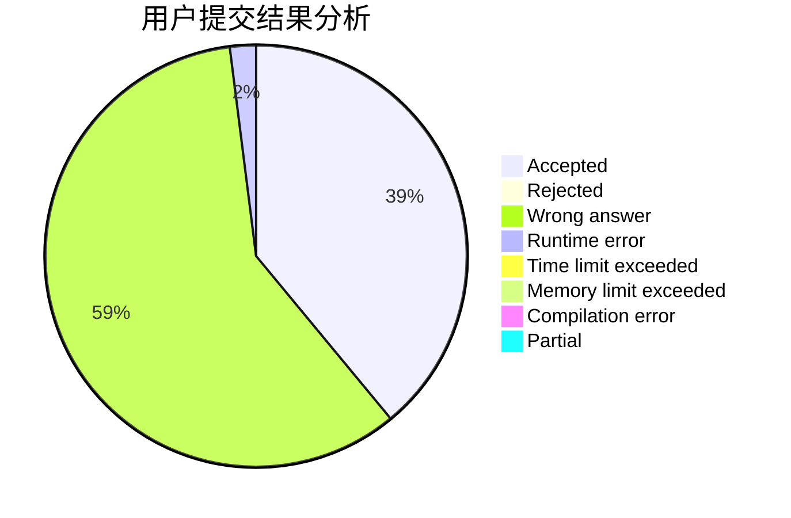
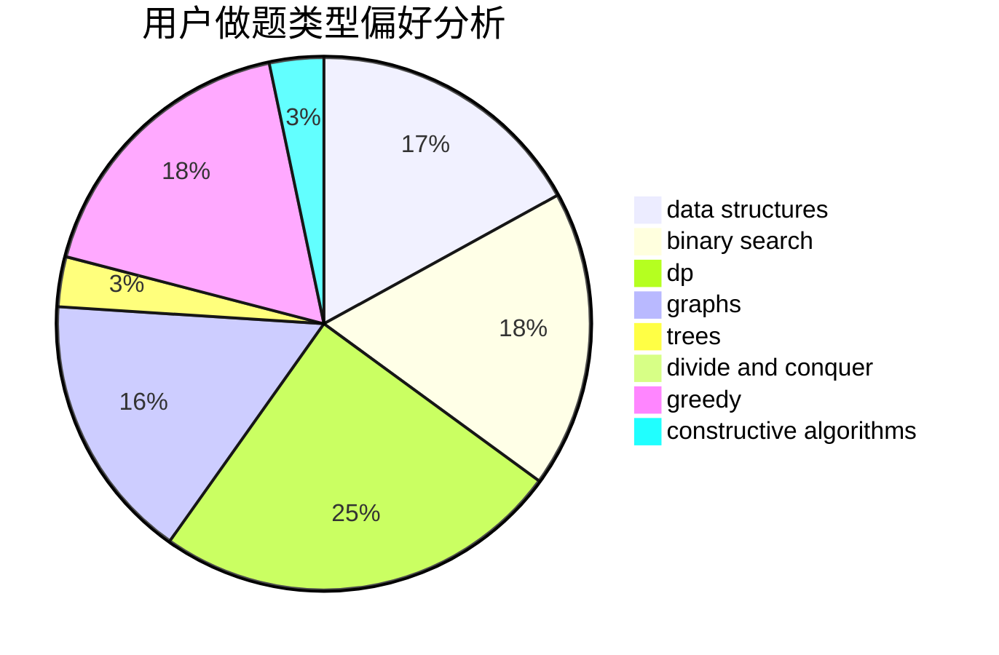
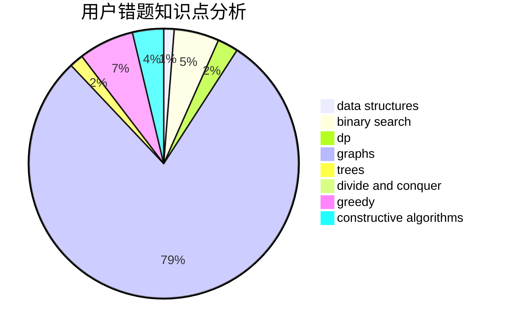

# work_hard.

<!-- tabs:start -->

#### **用户提交结果分析**

#### **用户做题类型偏好分析**

#### **用户错题知识点分析**

<!-- tabs:end -->
# 推荐题目
[802B](https://codeforces.com/contest/802/problem/B)		data structures,
                        greedy		  
[669D](https://codeforces.com/contest/669/problem/D)		dsu,graphs,sortings,trees		  
[1184E3](https://codeforces.com/contest/1184E/problem/3)		data structures,
                        dsu,
                        graphs,
                        trees		  
[1207C](https://codeforces.com/contest/1207/problem/C)		dp,
                        greedy		  
[918B](https://codeforces.com/contest/918/problem/B)		implementation,
                        strings		  
[1401C](https://codeforces.com/contest/1401/problem/C)		constructive algorithms,
                        math,
                        number theory,
                        sortings		  
[389B](https://codeforces.com/contest/389/problem/B)		greedy,
                        implementation		  
[1272D](https://codeforces.com/contest/1272/problem/D)		brute force,
                        dp		  
[272D](https://codeforces.com/contest/272/problem/D)		combinatorics,
                        math,
                        sortings		  
[1070C](https://codeforces.com/contest/1070/problem/C)		data structures,
                        greedy		  
