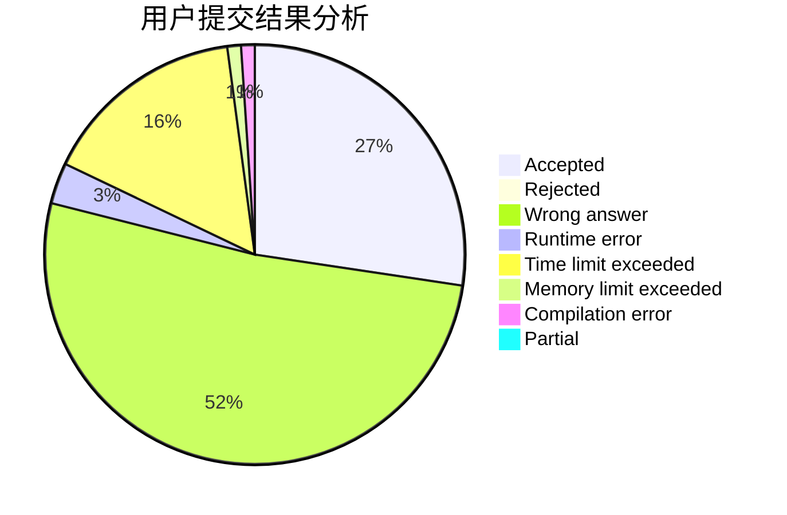
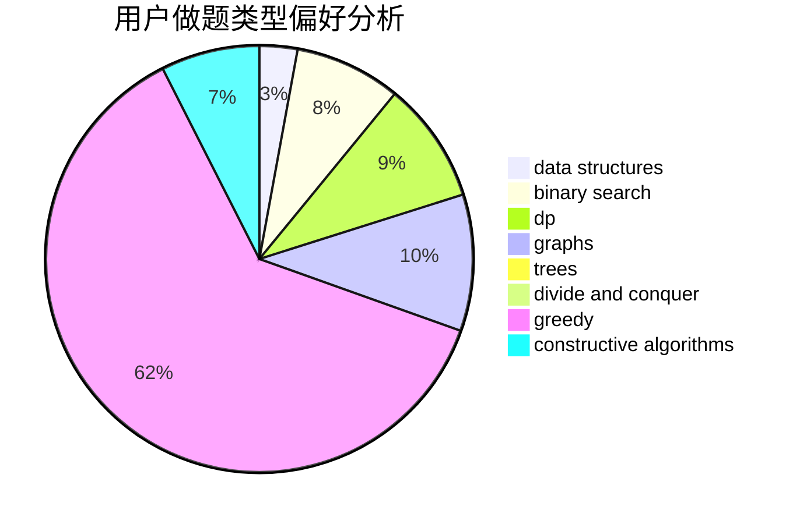
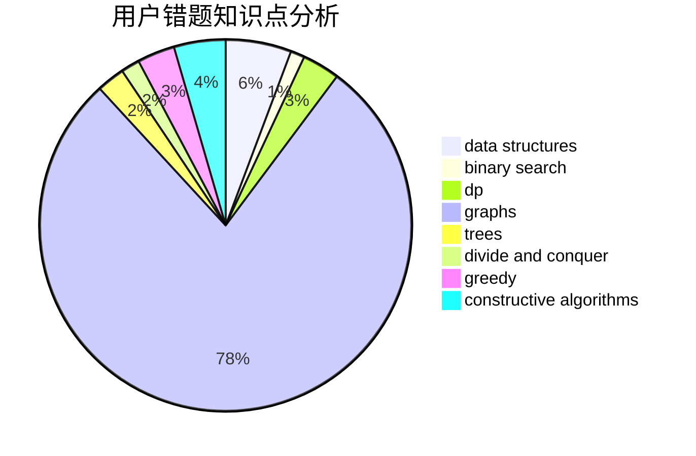

# woshihcw

<!-- tabs:start -->

#### **用户提交结果分析**

#### **用户做题类型偏好分析**

#### **用户错题知识点分析**

<!-- tabs:end -->
# 推荐题目
[318A](https://codeforces.com/contest/318/problem/A)		math		  
[1466G](https://codeforces.com/contest/1466/problem/G)		combinatorics,
                        divide and conquer,
                        hashing,
                        math,
                        string suffix structures,
                        strings		  
[931A](https://codeforces.com/contest/931/problem/A)		brute force,
                        greedy,
                        implementation,
                        math		  
[621C](https://codeforces.com/contest/621/problem/C)		combinatorics,
                        math,
                        number theory,
                        probabilities		  
[1143D](https://codeforces.com/contest/1143/problem/D)		dsu,graphs,sortings,trees		  
[1315D](https://codeforces.com/contest/1315/problem/D)		dsu,graphs,sortings,trees		  
[1072C](https://codeforces.com/contest/1072/problem/C)		dsu,graphs,sortings,trees		  
[334B](https://codeforces.com/contest/334/problem/B)		sortings		  
[1420A](https://codeforces.com/contest/1420/problem/A)		math,
                        sortings		  
[982E](https://codeforces.com/contest/982/problem/E)		geometry,
                        number theory		  
