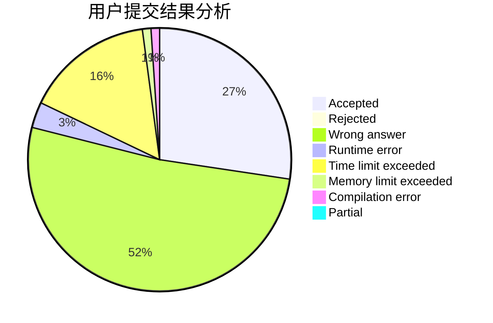
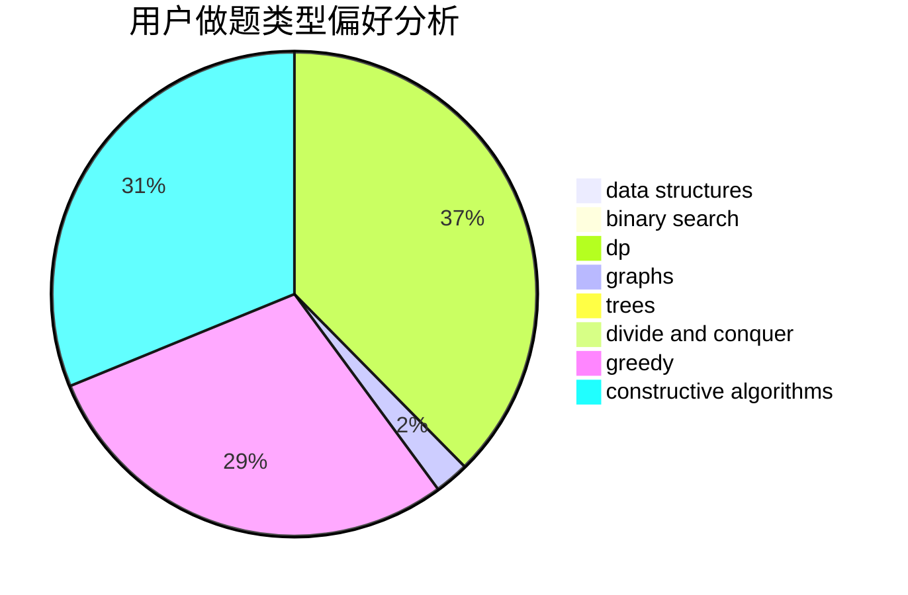
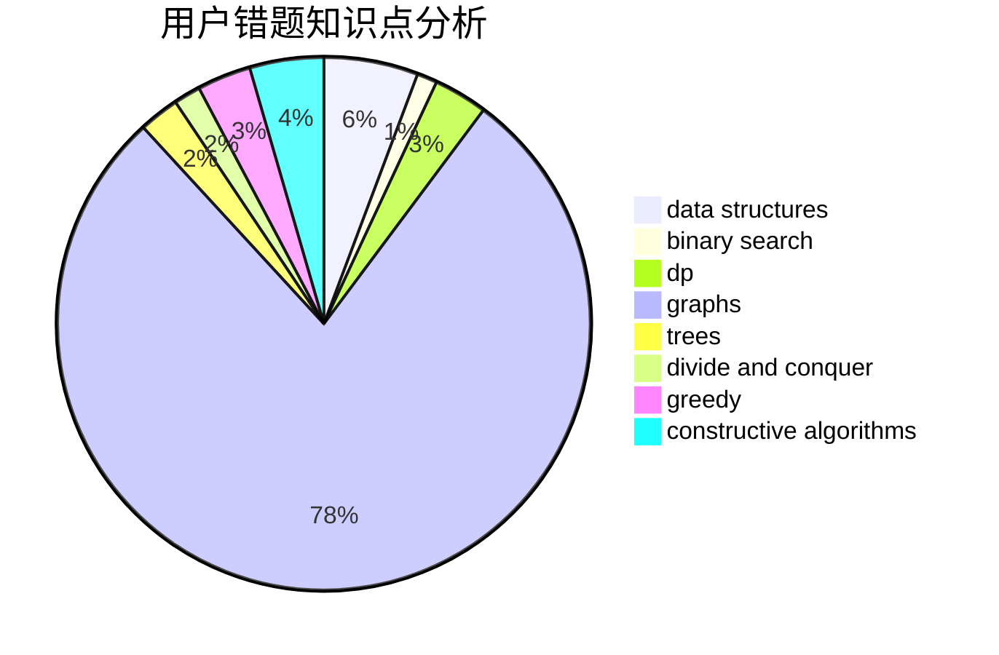

# woshihcw

<!-- tabs:start -->

#### **用户提交结果分析**

#### **用户做题类型偏好分析**

#### **用户错题知识点分析**

<!-- tabs:end -->
# 推荐题目
[348B](https://codeforces.com/contest/348/problem/B)		dfs and similar,
                        number theory,
                        trees		  
[1473G](https://codeforces.com/contest/1473/problem/G)		combinatorics,
                        dp,
                        fft,
                        math		  
[952A](https://codeforces.com/contest/952/problem/A)		math		  
[645E](https://codeforces.com/contest/645/problem/E)		dp,
                        greedy,
                        strings		  
[1145D](https://codeforces.com/contest/1145/problem/D)		implementation		  
[1325C](https://codeforces.com/contest/1325/problem/C)		constructive algorithms,
                        dfs and similar,
                        greedy,
                        trees		  
[1073B](https://codeforces.com/contest/1073/problem/B)		implementation,
                        math		  
[360D](https://codeforces.com/contest/360/problem/D)		number theory		  
[1427H](https://codeforces.com/contest/1427/problem/H)		binary search,
                        games,
                        geometry,
                        ternary search		  
[998C](https://codeforces.com/contest/998/problem/C)		dsu,graphs,sortings,trees		  
