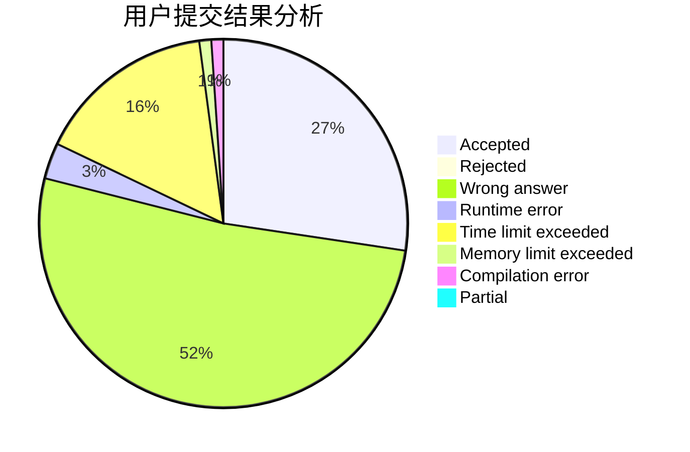
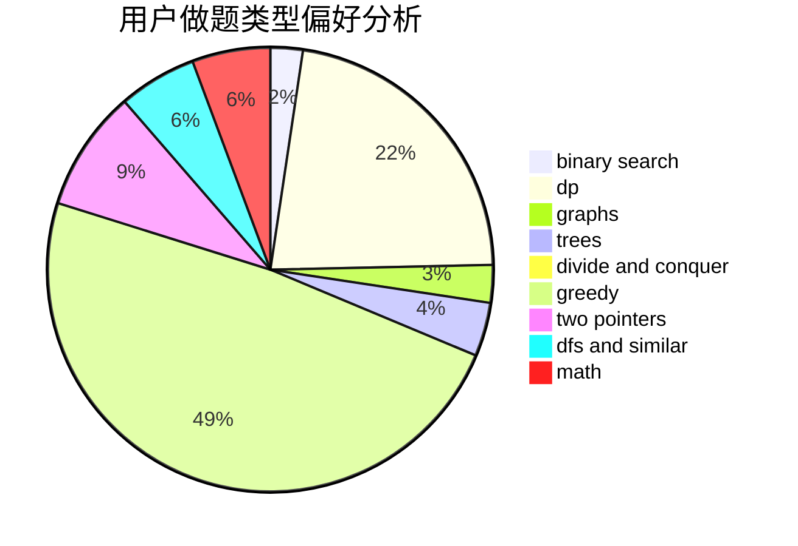

# woshihcw

<!-- tabs:start -->

#### **用户提交结果分析**

#### **用户做题类型偏好分析**

<!-- tabs:end -->
# 推荐题目
[348B](https://codeforces.com/contest/348/problem/B)
[1473G](https://codeforces.com/contest/1473/problem/G)
[952A](https://codeforces.com/contest/952/problem/A)
[645E](https://codeforces.com/contest/645/problem/E)
[1145D](https://codeforces.com/contest/1145/problem/D)
[1325C](https://codeforces.com/contest/1325/problem/C)
[1073B](https://codeforces.com/contest/1073/problem/B)
[360D](https://codeforces.com/contest/360/problem/D)
[1427H](https://codeforces.com/contest/1427/problem/H)
[998C](https://codeforces.com/contest/998/problem/C)
