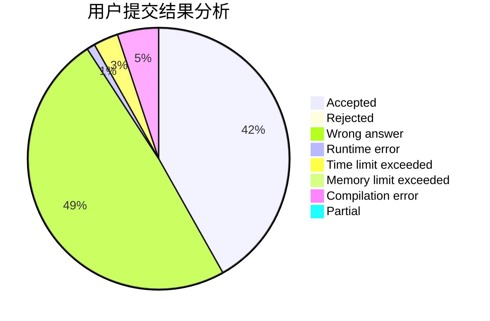
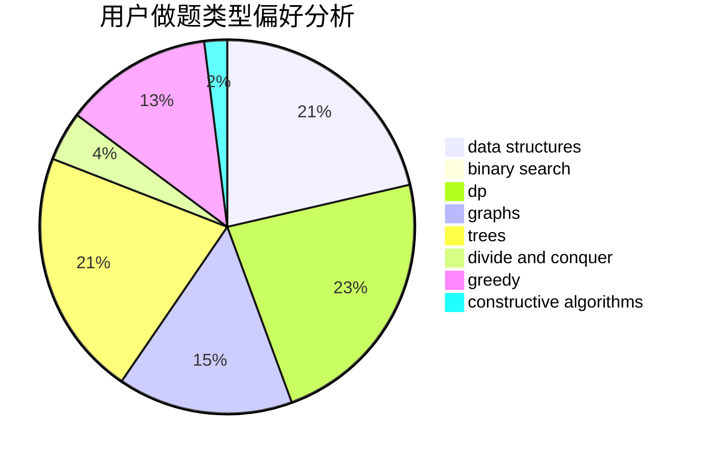

# woshiluo

<!-- tabs:start -->

#### **用户提交结果分析**

#### **用户做题类型偏好分析**

#### **用户错题知识点分析**

<!-- tabs:end -->
# 推荐题目
[acmsguru5](https://codeforces.com/contest/acmsguru/problem/5)		dsu,graphs,sortings,trees		  
[786A](https://codeforces.com/contest/786/problem/A)		dfs and similar,
                        dp,
                        games		  
[1000G](https://codeforces.com/contest/1000/problem/G)		data structures,
                        dp,
                        trees		  
[429A](https://codeforces.com/contest/429/problem/A)		dfs and similar,
                        trees		  
[201C](https://codeforces.com/contest/201/problem/C)		dp		  
[803F](https://codeforces.com/contest/803/problem/F)		bitmasks,
                        combinatorics,
                        number theory		  
[10C](https://codeforces.com/contest/10/problem/C)		number theory		  
[1470F](https://codeforces.com/contest/1470/problem/F)		divide and conquer		  
[98E](https://codeforces.com/contest/98/problem/E)		dp,
                        games,
                        math,
                        probabilities		  
[864C](https://codeforces.com/contest/864/problem/C)		greedy,
                        implementation,
                        math		  
