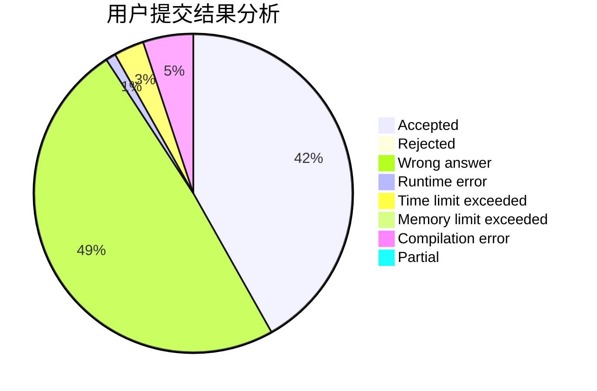
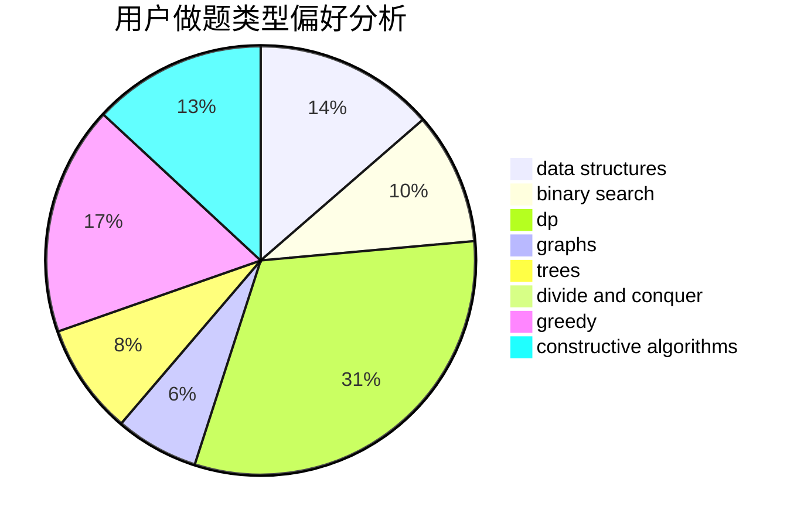

# woshiluo

<!-- tabs:start -->

#### **用户提交结果分析**

#### **用户做题类型偏好分析**

#### **用户错题知识点分析**

<!-- tabs:end -->
# 推荐题目
[986C](https://codeforces.com/contest/986/problem/C)		bitmasks,
                        dfs and similar,
                        dsu,
                        graphs		  
[766D](https://codeforces.com/contest/766/problem/D)		data structures,
                        dfs and similar,
                        dp,
                        dsu,
                        graphs		  
[1000G](https://codeforces.com/contest/1000/problem/G)		data structures,
                        dp,
                        trees		  
[39J](https://codeforces.com/contest/39/problem/J)		hashing,
                        implementation,
                        strings		  
[176D](https://codeforces.com/contest/176/problem/D)		dp		  
[788B](https://codeforces.com/contest/788/problem/B)		combinatorics,
                        constructive algorithms,
                        dfs and similar,
                        dsu,
                        graphs		  
[109A](https://codeforces.com/contest/109/problem/A)		brute force,
                        implementation		  
[1463E](https://codeforces.com/contest/1463/problem/E)		constructive algorithms,
                        dfs and similar,
                        dsu,
                        graphs,
                        implementation,
                        sortings,
                        trees		  
[976A](https://codeforces.com/contest/976/problem/A)		implementation		  
[846A](https://codeforces.com/contest/846/problem/A)		brute force,
                        implementation		  
