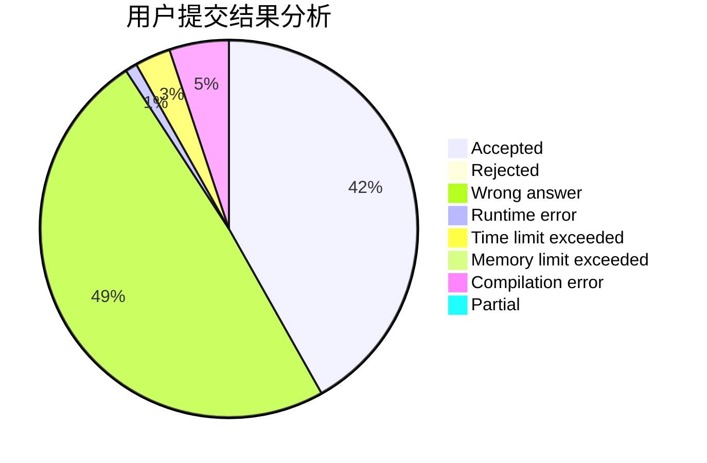
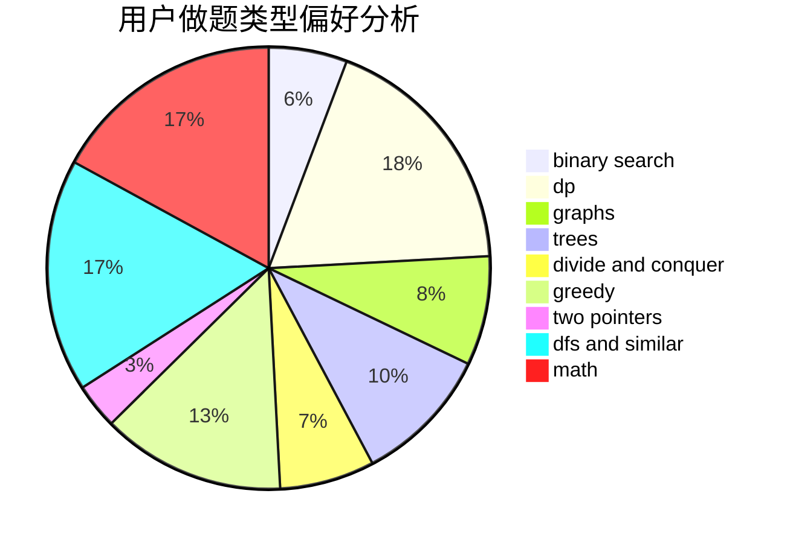

# woshiluo

<!-- tabs:start -->

#### **用户提交结果分析**

#### **用户做题类型偏好分析**

<!-- tabs:end -->
# 推荐题目
[acmsguru5](https://codeforces.com/contest/acmsguru/problem/5)
[786A](https://codeforces.com/contest/786/problem/A)
[1000G](https://codeforces.com/contest/1000/problem/G)
[429A](https://codeforces.com/contest/429/problem/A)
[201C](https://codeforces.com/contest/201/problem/C)
[803F](https://codeforces.com/contest/803/problem/F)
[10C](https://codeforces.com/contest/10/problem/C)
[1470F](https://codeforces.com/contest/1470/problem/F)
[98E](https://codeforces.com/contest/98/problem/E)
[864C](https://codeforces.com/contest/864/problem/C)
