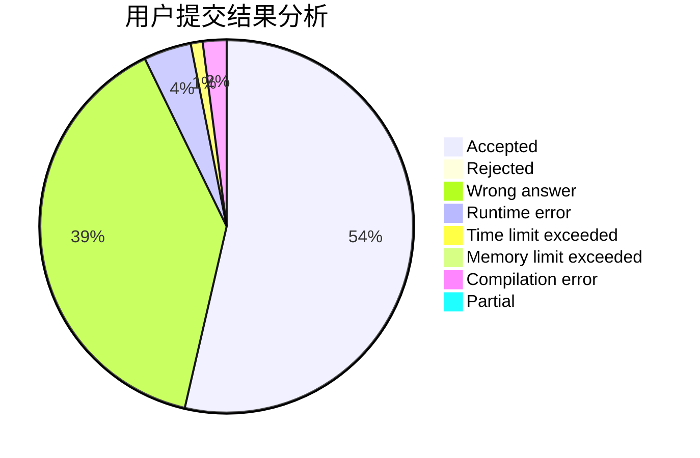
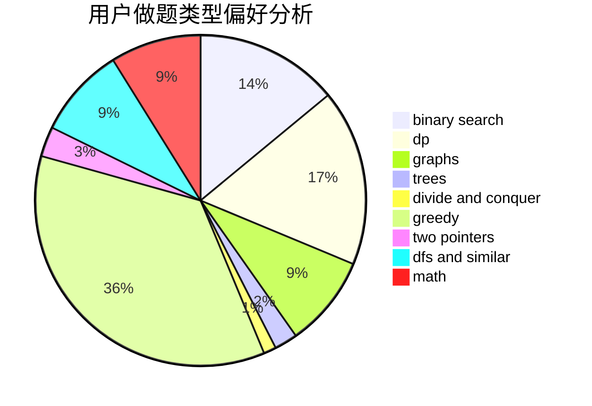

# Camouflager

<!-- tabs:start -->

#### **用户提交结果分析**

#### **用户做题类型偏好分析**

<!-- tabs:end -->
# 推荐题目
[665C](https://codeforces.com/contest/665/problem/C)
[665D](https://codeforces.com/contest/665/problem/D)
[1278A](https://codeforces.com/contest/1278/problem/A)
[58E](https://codeforces.com/contest/58/problem/E)
[656A](https://codeforces.com/contest/656/problem/A)
[1082F](https://codeforces.com/contest/1082/problem/F)
[662D](https://codeforces.com/contest/662/problem/D)
[1280A](https://codeforces.com/contest/1280/problem/A)
[299C](https://codeforces.com/contest/299/problem/C)
[1027D](https://codeforces.com/contest/1027/problem/D)
