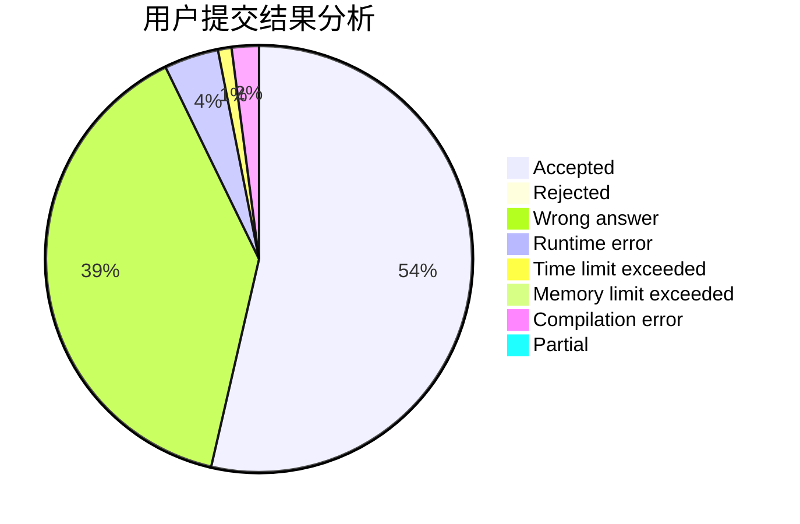
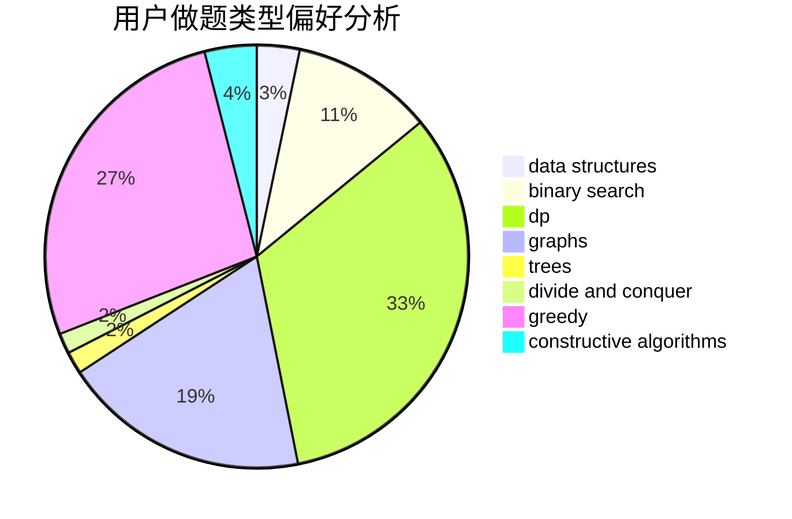
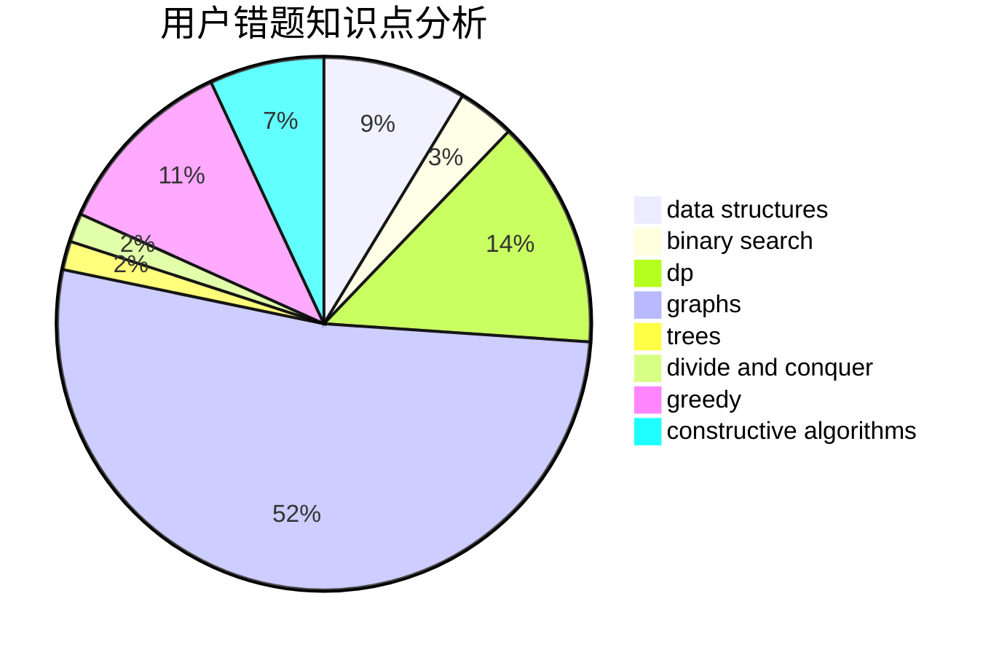

# Camouflager

<!-- tabs:start -->

#### **用户提交结果分析**

#### **用户做题类型偏好分析**

#### **用户错题知识点分析**

<!-- tabs:end -->
# 推荐题目
[633A](https://codeforces.com/contest/633/problem/A)		brute force,
                        math,
                        number theory		  
[633B](https://codeforces.com/contest/633/problem/B)		brute force,
                        constructive algorithms,
                        math,
                        number theory		  
[1269A](https://codeforces.com/contest/1269/problem/A)		brute force,
                        math		  
[56B](https://codeforces.com/contest/56/problem/B)		implementation		  
[628B](https://codeforces.com/contest/628/problem/B)		dp		  
[1082C](https://codeforces.com/contest/1082/problem/C)		greedy,
                        sortings		  
[631E](https://codeforces.com/contest/631/problem/E)		data structures,
                        dp,
                        geometry		  
[1270H](https://codeforces.com/contest/1270/problem/H)		data structures		  
[282E](https://codeforces.com/contest/282/problem/E)		bitmasks,
                        data structures,
                        trees		  
[1027A](https://codeforces.com/contest/1027/problem/A)		implementation,
                        strings		  
