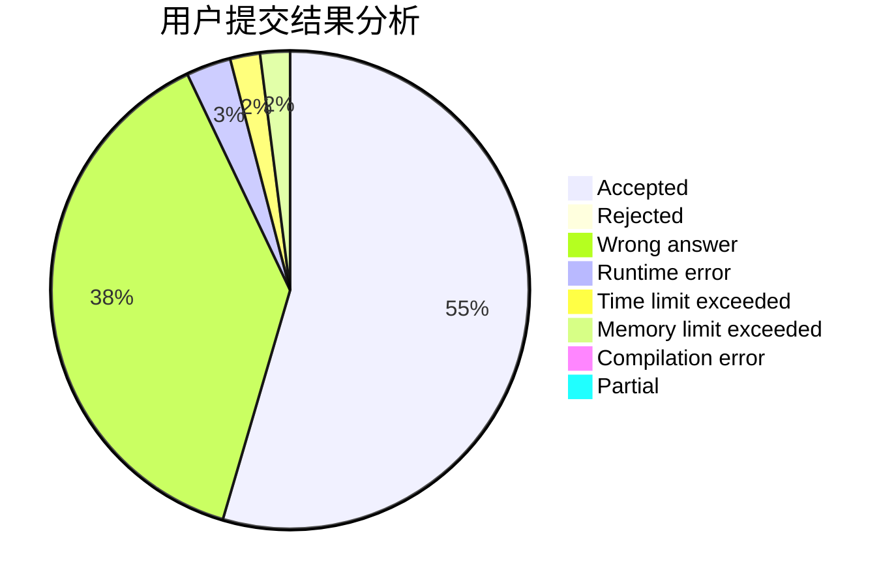
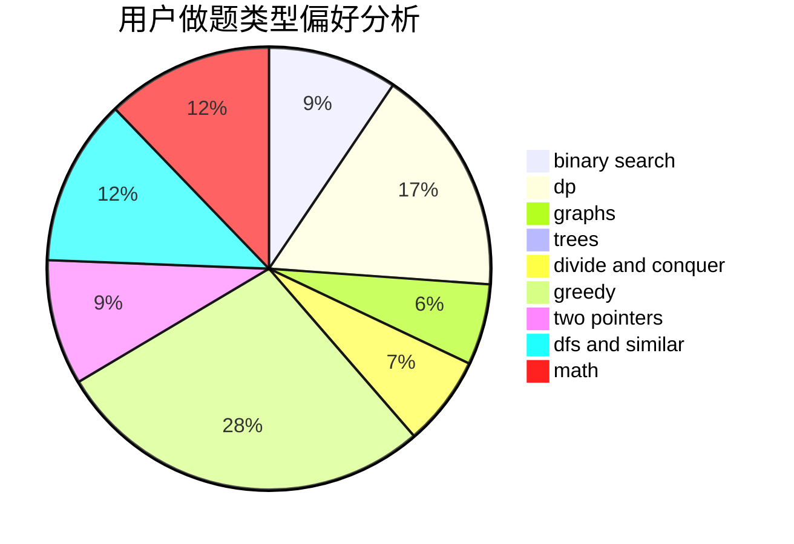

# wqy_03

<!-- tabs:start -->

#### **用户提交结果分析**

#### **用户做题类型偏好分析**

<!-- tabs:end -->
# 推荐题目
[25A](https://codeforces.com/contest/25/problem/A)
[1267I](https://codeforces.com/contest/1267/problem/I)
[176B](https://codeforces.com/contest/176/problem/B)
[861A](https://codeforces.com/contest/861/problem/A)
[383E](https://codeforces.com/contest/383/problem/E)
[429A](https://codeforces.com/contest/429/problem/A)
[290B](https://codeforces.com/contest/290/problem/B)
[1230D](https://codeforces.com/contest/1230/problem/D)
[627F](https://codeforces.com/contest/627/problem/F)
[335A](https://codeforces.com/contest/335/problem/A)
