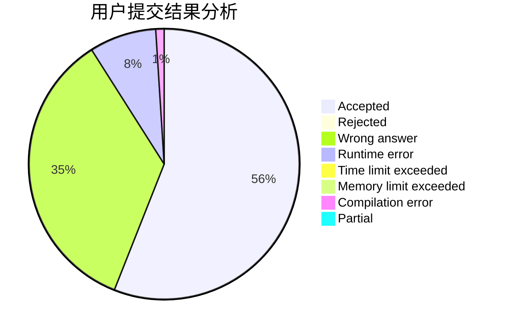
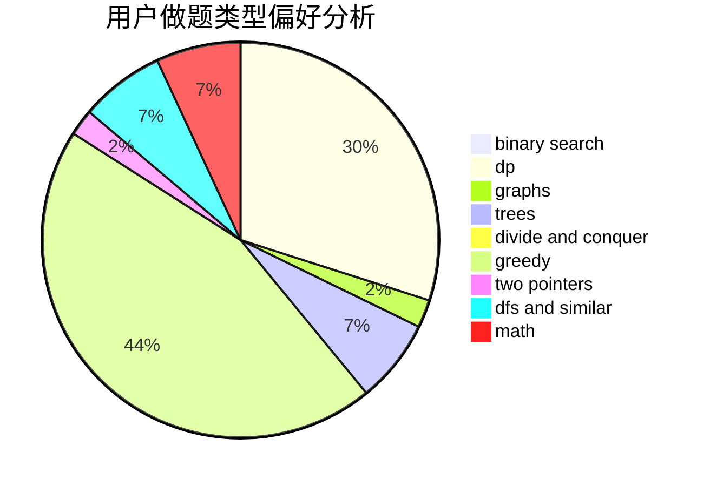

# wssstc

<!-- tabs:start -->

#### **用户提交结果分析**

#### **用户做题类型偏好分析**

<!-- tabs:end -->
# 推荐题目
[1433F](https://codeforces.com/contest/1433/problem/F)
[1292E](https://codeforces.com/contest/1292/problem/E)
[715A](https://codeforces.com/contest/715/problem/A)
[1386B](https://codeforces.com/contest/1386/problem/B)
[886A](https://codeforces.com/contest/886/problem/A)
[713E](https://codeforces.com/contest/713/problem/E)
[866C](https://codeforces.com/contest/866/problem/C)
[446D](https://codeforces.com/contest/446/problem/D)
[431D](https://codeforces.com/contest/431/problem/D)
[1503F](https://codeforces.com/contest/1503/problem/F)
