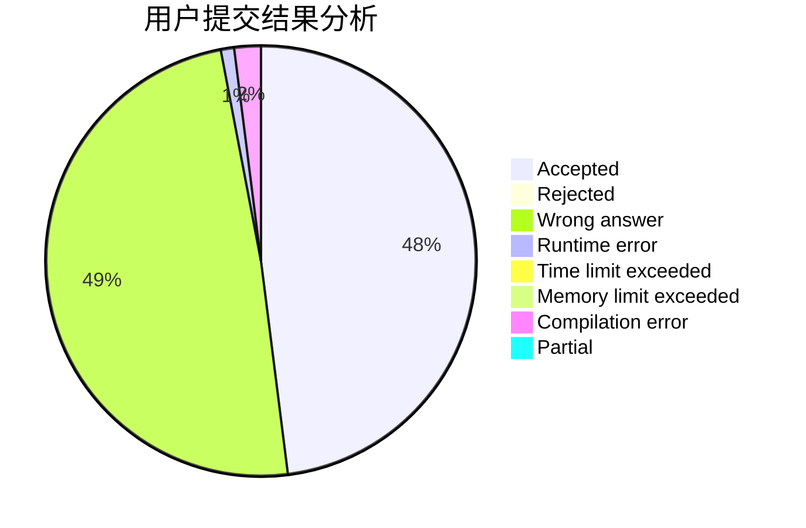
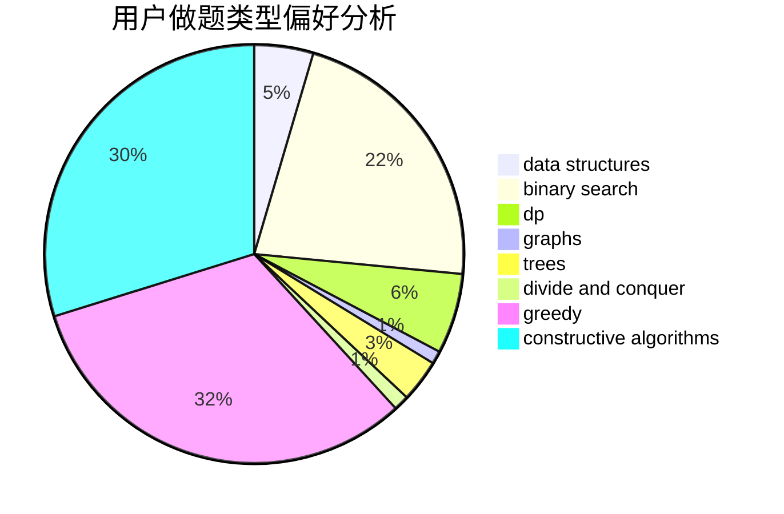
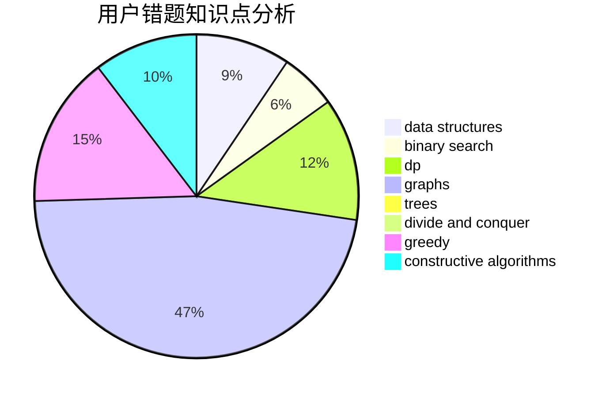

# wuchaojie925

<!-- tabs:start -->

#### **用户提交结果分析**

#### **用户做题类型偏好分析**

#### **用户错题知识点分析**

<!-- tabs:end -->
# 推荐题目
[249E](https://codeforces.com/contest/249/problem/E)		math		  
[601B](https://codeforces.com/contest/601/problem/B)		data structures,
                        math		  
[47B](https://codeforces.com/contest/47/problem/B)		implementation		  
[594E](https://codeforces.com/contest/594/problem/E)		string suffix structures,
                        strings		  
[80B](https://codeforces.com/contest/80/problem/B)		geometry,
                        math		  
[319C](https://codeforces.com/contest/319/problem/C)		dp,
                        geometry		  
[1076F](https://codeforces.com/contest/1076/problem/F)		dp,
                        greedy		  
[79D](https://codeforces.com/contest/79/problem/D)		bitmasks,
                        dp,
                        shortest paths		  
[1031D](https://codeforces.com/contest/1031/problem/D)		greedy		  
[1121B](https://codeforces.com/contest/1121/problem/B)		brute force,
                        implementation		  
