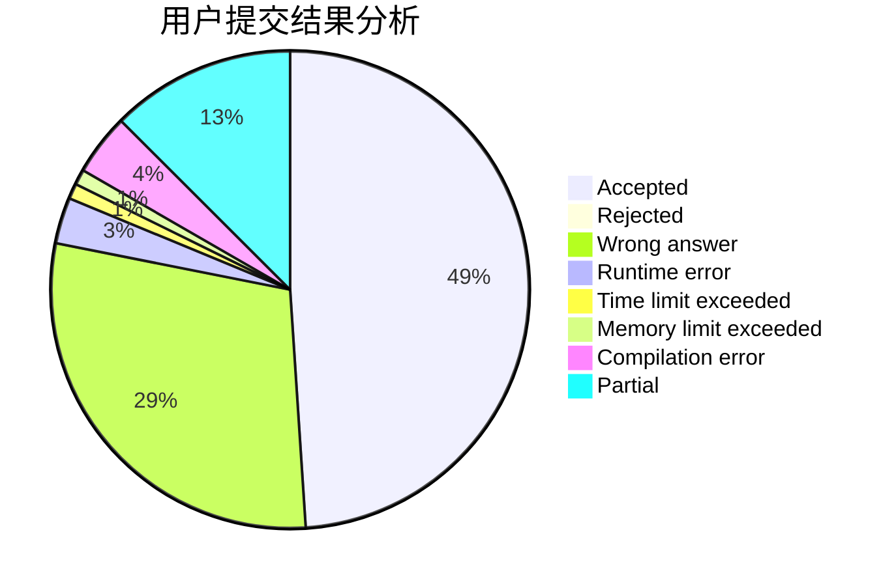
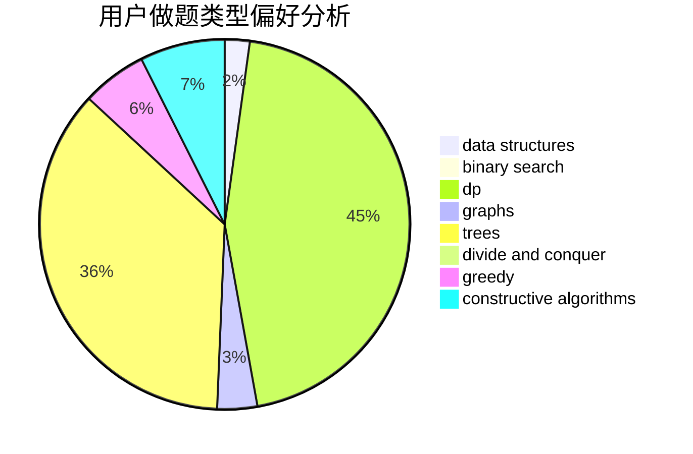
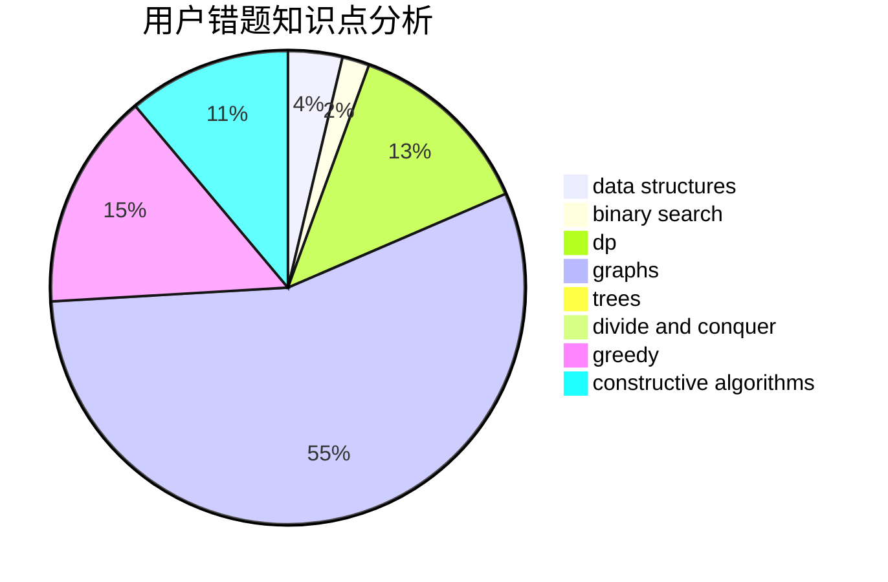

# wucstdio

<!-- tabs:start -->

#### **用户提交结果分析**

#### **用户做题类型偏好分析**

#### **用户错题知识点分析**

<!-- tabs:end -->
# 推荐题目
[1204A](https://codeforces.com/contest/1204/problem/A)		math		  
[1007A](https://codeforces.com/contest/1007/problem/A)		combinatorics,
                        data structures,
                        math,
                        sortings,
                        two pointers		  
[1132F](https://codeforces.com/contest/1132/problem/F)		dp		  
[1142C](https://codeforces.com/contest/1142/problem/C)		geometry		  
[723B](https://codeforces.com/contest/723/problem/B)		expression parsing,
                        implementation,
                        strings		  
[414B](https://codeforces.com/contest/414/problem/B)		combinatorics,
                        dp,
                        number theory		  
[1340B](https://codeforces.com/contest/1340/problem/B)		bitmasks,
                        dp,
                        graphs,
                        greedy		  
[402A](https://codeforces.com/contest/402/problem/A)		greedy,
                        math		  
[978G](https://codeforces.com/contest/978/problem/G)		greedy,
                        implementation,
                        sortings		  
[1003C](https://codeforces.com/contest/1003/problem/C)		brute force,
                        implementation,
                        math		  
