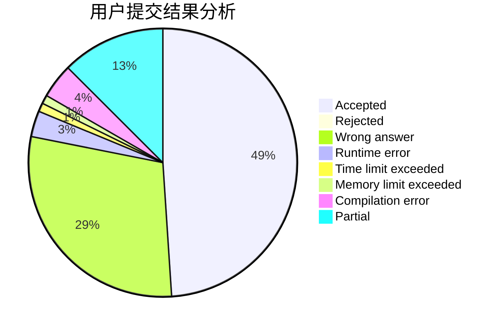
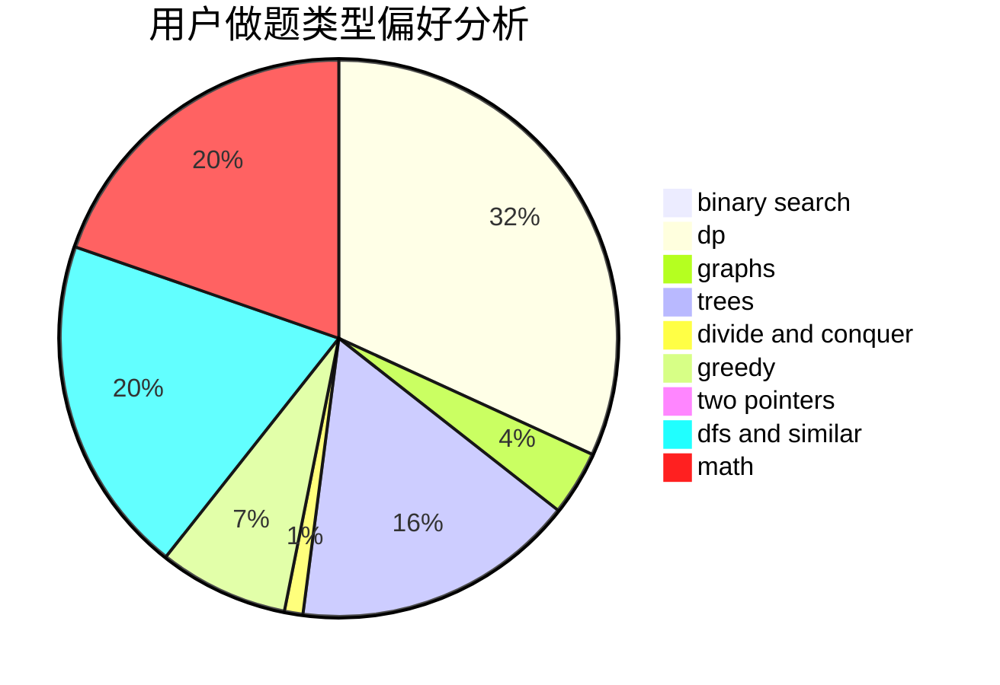

# wucstdio

<!-- tabs:start -->

#### **用户提交结果分析**

#### **用户做题类型偏好分析**

<!-- tabs:end -->
# 推荐题目
[1204A](https://codeforces.com/contest/1204/problem/A)
[1007A](https://codeforces.com/contest/1007/problem/A)
[1132F](https://codeforces.com/contest/1132/problem/F)
[1142C](https://codeforces.com/contest/1142/problem/C)
[723B](https://codeforces.com/contest/723/problem/B)
[414B](https://codeforces.com/contest/414/problem/B)
[1340B](https://codeforces.com/contest/1340/problem/B)
[402A](https://codeforces.com/contest/402/problem/A)
[978G](https://codeforces.com/contest/978/problem/G)
[1003C](https://codeforces.com/contest/1003/problem/C)
