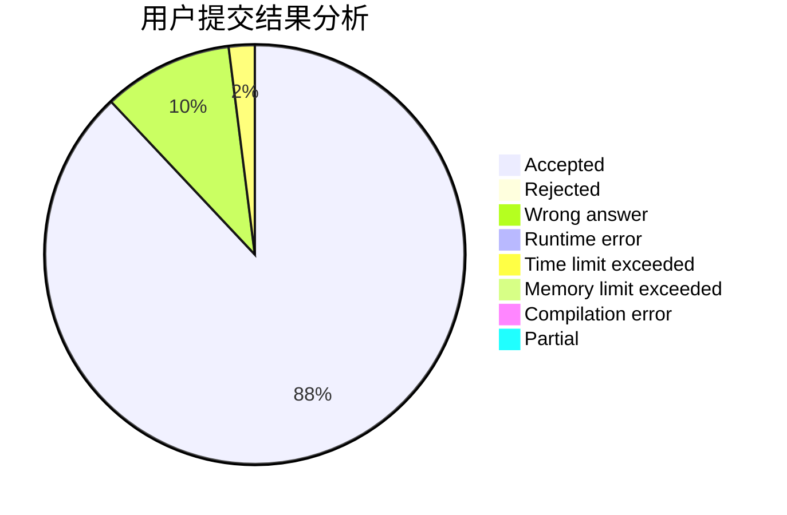
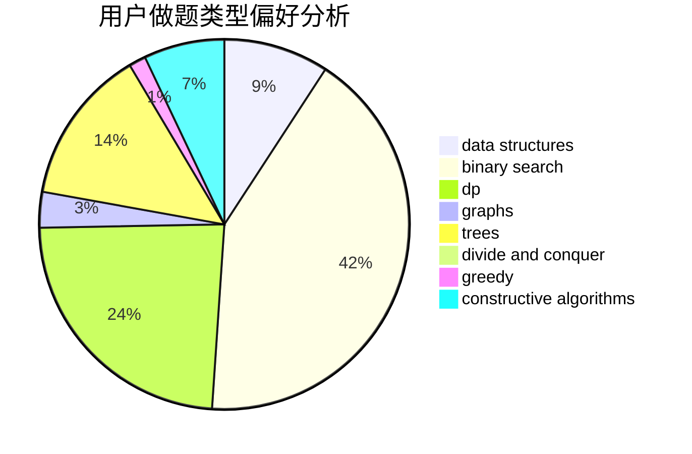
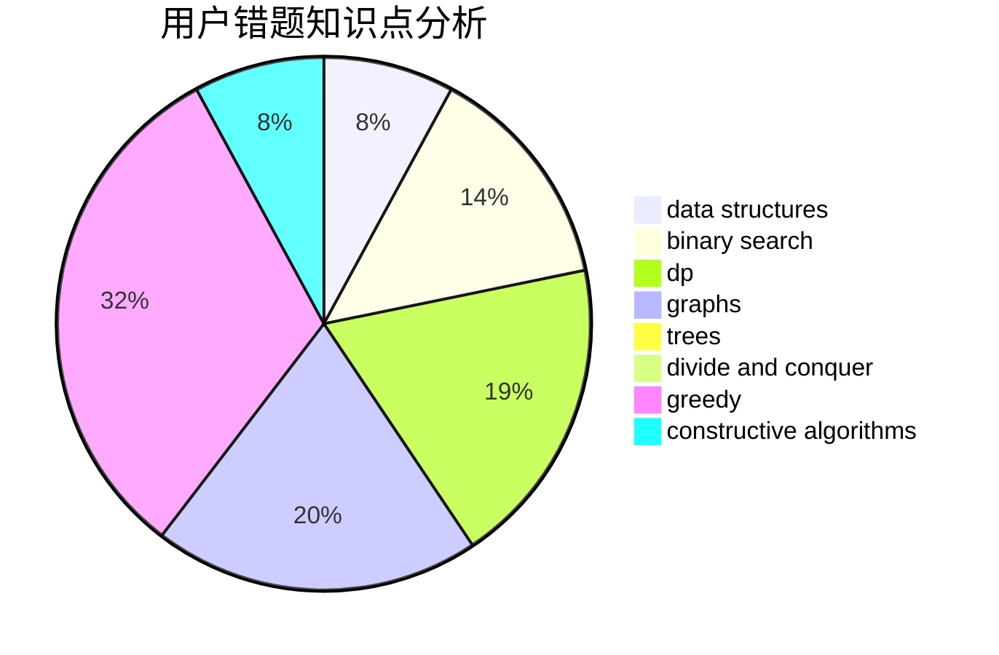

# wudengfendechengge

<!-- tabs:start -->

#### **用户提交结果分析**

#### **用户做题类型偏好分析**

#### **用户错题知识点分析**

<!-- tabs:end -->
# 推荐题目
[25A](https://codeforces.com/contest/25/problem/A)		brute force		  
[295B](https://codeforces.com/contest/295/problem/B)		dp,
                        graphs,
                        shortest paths		  
[1119F](https://codeforces.com/contest/1119/problem/F)		data structures,
                        dp,
                        trees		  
[1772](https://codeforces.com/contest/177/problem/2)		dsu,graphs,sortings,trees		  
[1090F](https://codeforces.com/contest/1090/problem/F)		constructive algorithms,
                        interactive		  
[301C](https://codeforces.com/contest/301/problem/C)		constructive algorithms		  
[136D](https://codeforces.com/contest/136/problem/D)		dsu,graphs,sortings,trees		  
[1150B](https://codeforces.com/contest/1150/problem/B)		greedy,
                        implementation		  
[80A](https://codeforces.com/contest/80/problem/A)		brute force		  
[731B](https://codeforces.com/contest/731/problem/B)		constructive algorithms,
                        greedy		  
