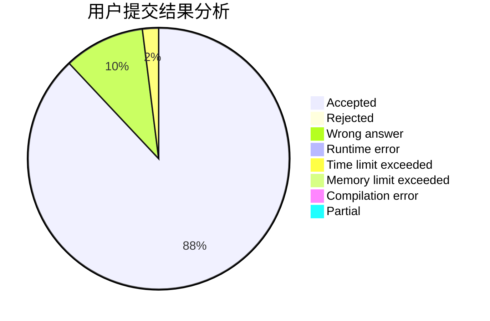
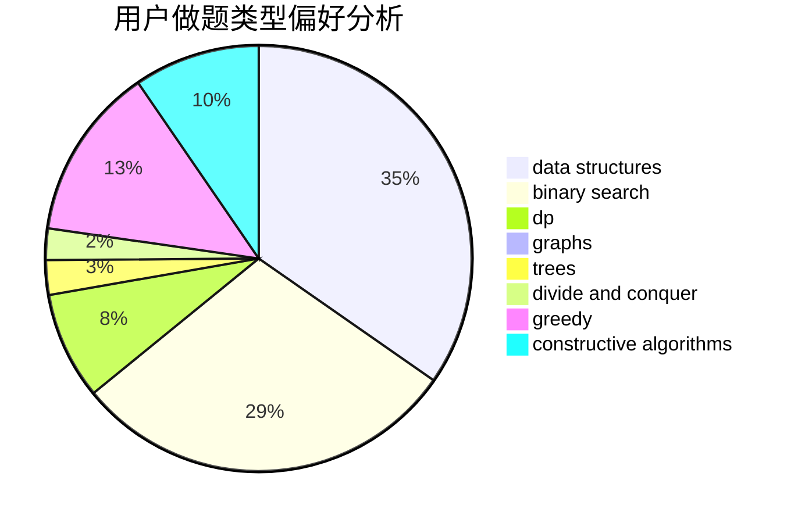
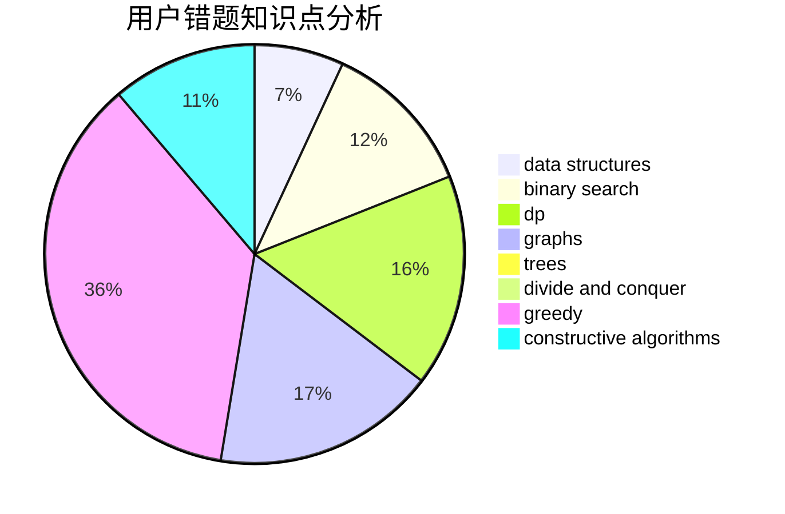

# wudengfendechengge

<!-- tabs:start -->

#### **用户提交结果分析**

#### **用户做题类型偏好分析**

#### **用户错题知识点分析**

<!-- tabs:end -->
# 推荐题目
[236D](https://codeforces.com/contest/236/problem/D)		dsu,graphs,sortings,trees		  
[27C](https://codeforces.com/contest/27/problem/C)		constructive algorithms,
                        greedy		  
[1118A](https://codeforces.com/contest/1118/problem/A)		math		  
[156D](https://codeforces.com/contest/156/problem/D)		combinatorics,
                        graphs		  
[1090A](https://codeforces.com/contest/1090/problem/A)		greedy		  
[288B](https://codeforces.com/contest/288/problem/B)		combinatorics		  
[1362E](https://codeforces.com/contest/1362/problem/E)		dsu,graphs,sortings,trees		  
[1148G](https://codeforces.com/contest/1148/problem/G)		constructive algorithms,
                        graphs,
                        math,
                        number theory,
                        probabilities		  
[794G](https://codeforces.com/contest/794/problem/G)		combinatorics,
                        dp,
                        math		  
[711B](https://codeforces.com/contest/711/problem/B)		constructive algorithms,
                        implementation		  
