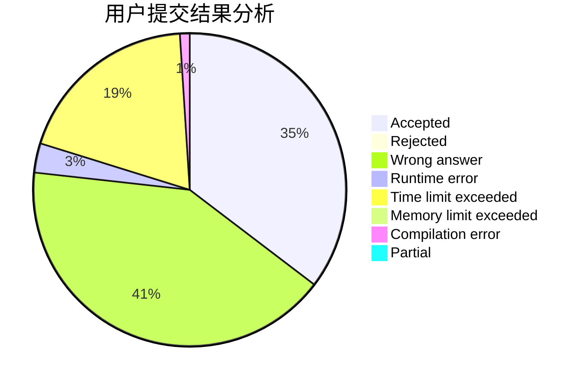
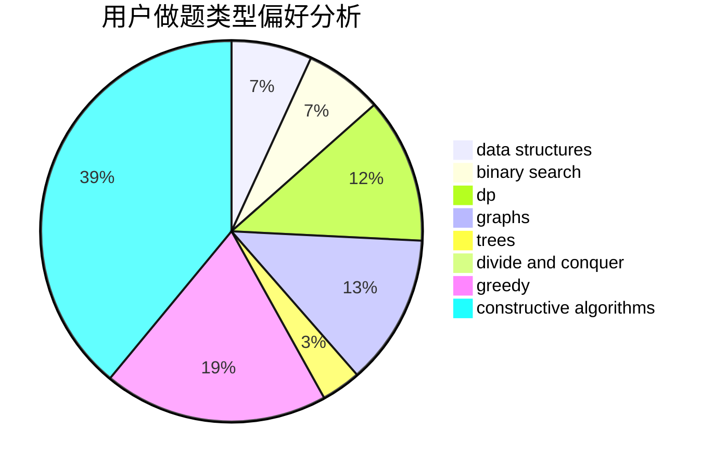
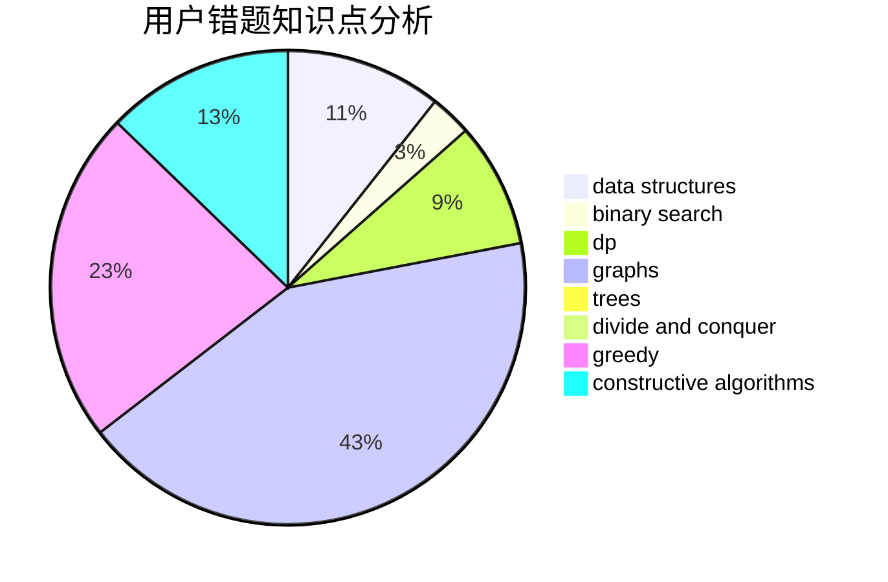

# wudixixi_txdy

<!-- tabs:start -->

#### **用户提交结果分析**

#### **用户做题类型偏好分析**

#### **用户错题知识点分析**

<!-- tabs:end -->
# 推荐题目
[1375C](https://codeforces.com/contest/1375/problem/C)		constructive algorithms,
                        data structures,
                        greedy		  
[274C](https://codeforces.com/contest/274/problem/C)		brute force,
                        geometry		  
[1207B](https://codeforces.com/contest/1207/problem/B)		constructive algorithms,
                        greedy,
                        implementation		  
[225E](https://codeforces.com/contest/225/problem/E)		math,
                        number theory		  
[1213E](https://codeforces.com/contest/1213/problem/E)		brute force,
                        constructive algorithms		  
[489F](https://codeforces.com/contest/489/problem/F)		combinatorics,
                        dp		  
[933B](https://codeforces.com/contest/933/problem/B)		math		  
[1062B](https://codeforces.com/contest/1062/problem/B)		greedy,
                        math,
                        number theory		  
[1070M](https://codeforces.com/contest/1070/problem/M)		constructive algorithms,
                        divide and conquer,
                        geometry		  
[1012B](https://codeforces.com/contest/1012/problem/B)		constructive algorithms,
                        dfs and similar,
                        dsu,
                        graphs,
                        matrices		  
