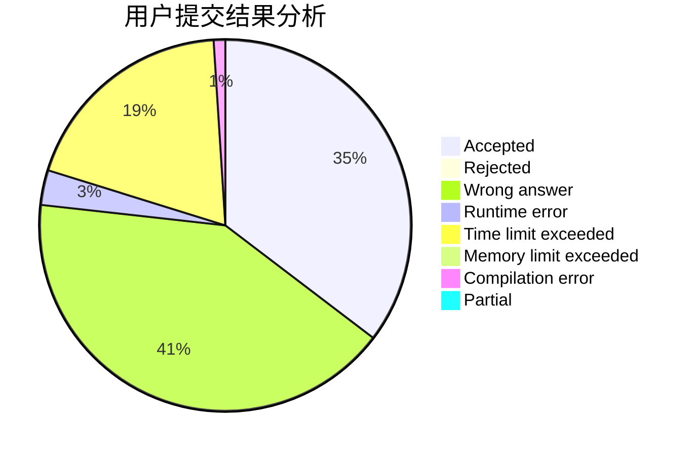
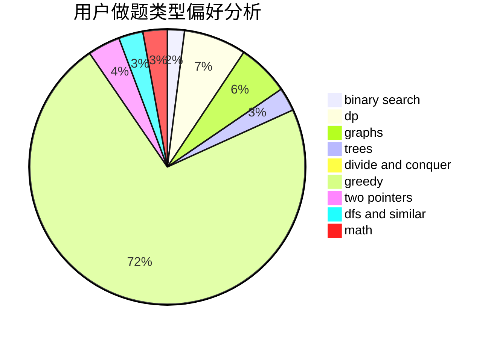

# wudixixi_txdy

<!-- tabs:start -->

#### **用户提交结果分析**

#### **用户做题类型偏好分析**

<!-- tabs:end -->
# 推荐题目
[1384A](https://codeforces.com/contest/1384/problem/A)
[28B](https://codeforces.com/contest/28/problem/B)
[1211B](https://codeforces.com/contest/1211/problem/B)
[244C](https://codeforces.com/contest/244/problem/C)
[1218H](https://codeforces.com/contest/1218/problem/H)
[50D](https://codeforces.com/contest/50/problem/D)
[955B](https://codeforces.com/contest/955/problem/B)
[1062E](https://codeforces.com/contest/1062/problem/E)
[1071C](https://codeforces.com/contest/1071/problem/C)
[1012F](https://codeforces.com/contest/1012/problem/F)
