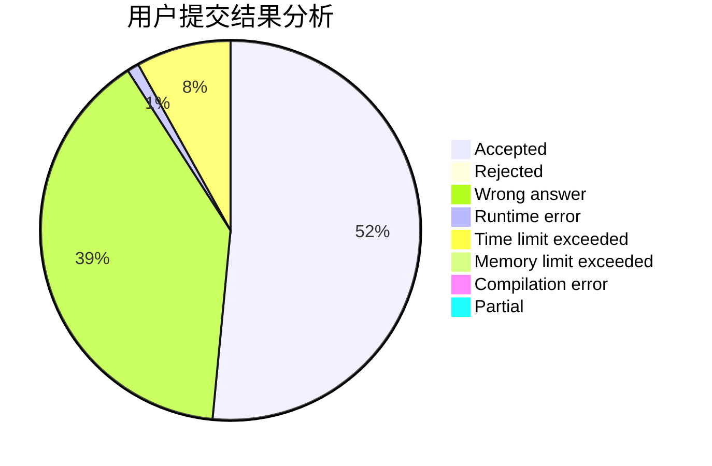
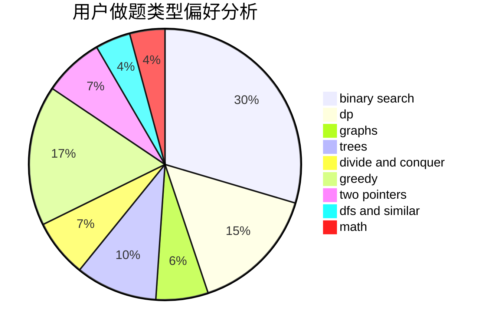

# wuruzhao

<!-- tabs:start -->

#### **用户提交结果分析**

#### **用户做题类型偏好分析**

<!-- tabs:end -->
# 推荐题目
[813F](https://codeforces.com/contest/813/problem/F)
[1080E](https://codeforces.com/contest/1080/problem/E)
[1473G](https://codeforces.com/contest/1473/problem/G)
[903A](https://codeforces.com/contest/903/problem/A)
[496A](https://codeforces.com/contest/496/problem/A)
[1004F](https://codeforces.com/contest/1004/problem/F)
[689D](https://codeforces.com/contest/689/problem/D)
[387D](https://codeforces.com/contest/387/problem/D)
[160A](https://codeforces.com/contest/160/problem/A)
[42A](https://codeforces.com/contest/42/problem/A)
