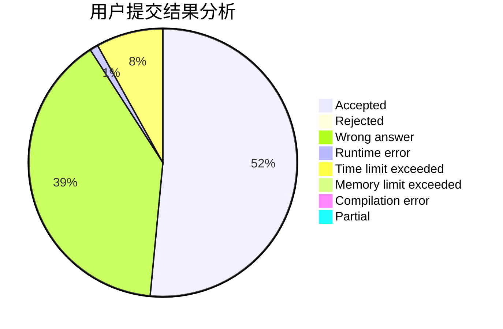
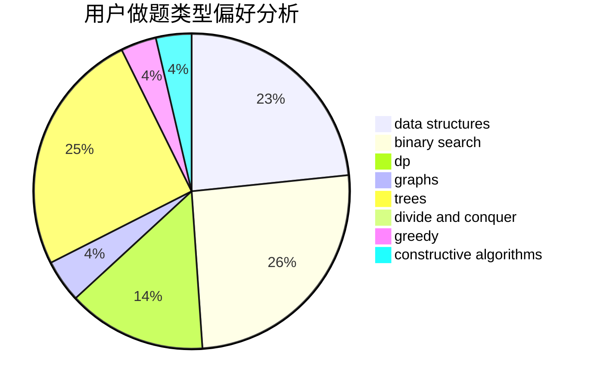
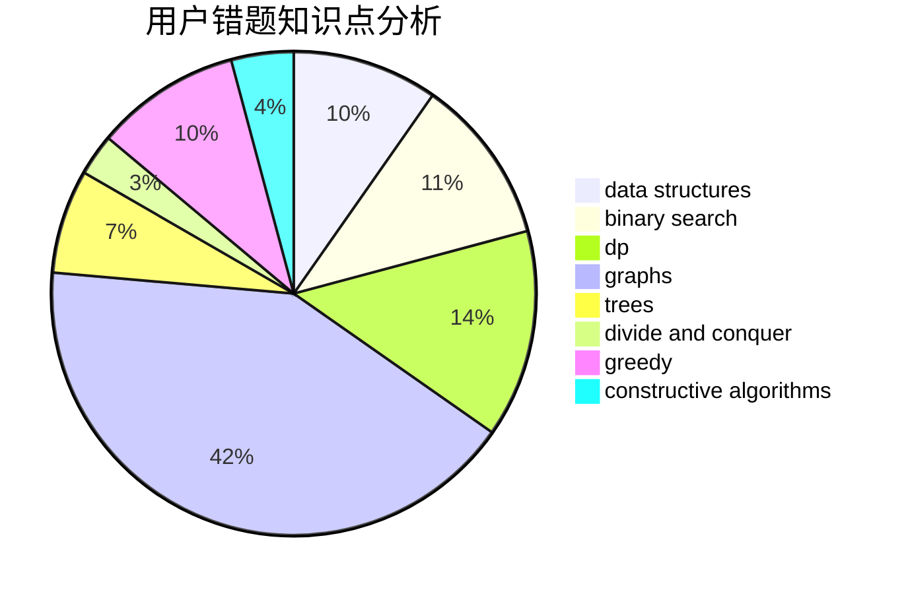

# wuruzhao

<!-- tabs:start -->

#### **用户提交结果分析**

#### **用户做题类型偏好分析**

#### **用户错题知识点分析**

<!-- tabs:end -->
# 推荐题目
[813F](https://codeforces.com/contest/813/problem/F)		data structures,
                        dsu,
                        graphs		  
[1080E](https://codeforces.com/contest/1080/problem/E)		strings		  
[1473G](https://codeforces.com/contest/1473/problem/G)		combinatorics,
                        dp,
                        fft,
                        math		  
[903A](https://codeforces.com/contest/903/problem/A)		greedy,
                        implementation		  
[496A](https://codeforces.com/contest/496/problem/A)		brute force,
                        implementation,
                        math		  
[1004F](https://codeforces.com/contest/1004/problem/F)		bitmasks,
                        data structures,
                        divide and conquer		  
[689D](https://codeforces.com/contest/689/problem/D)		binary search,
                        data structures		  
[387D](https://codeforces.com/contest/387/problem/D)		graph matchings		  
[160A](https://codeforces.com/contest/160/problem/A)		greedy,
                        sortings		  
[42A](https://codeforces.com/contest/42/problem/A)		greedy,
                        implementation		  
