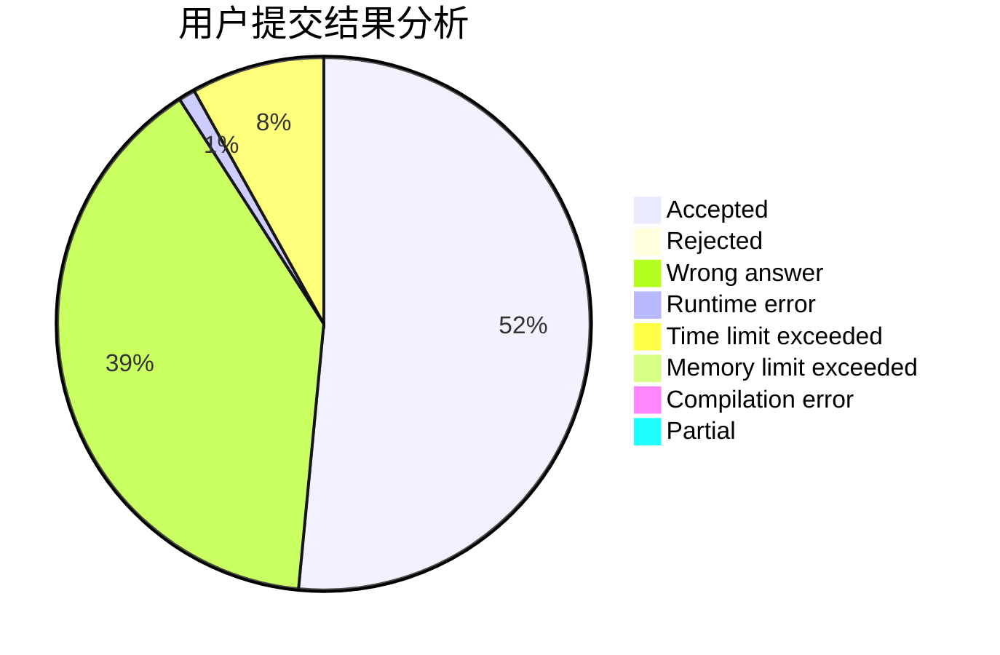
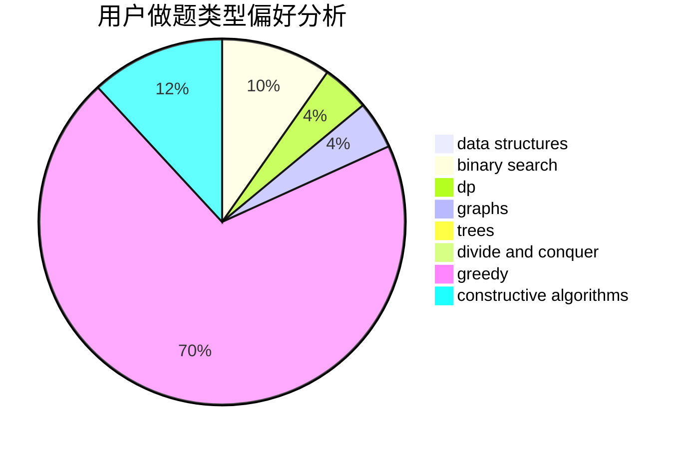
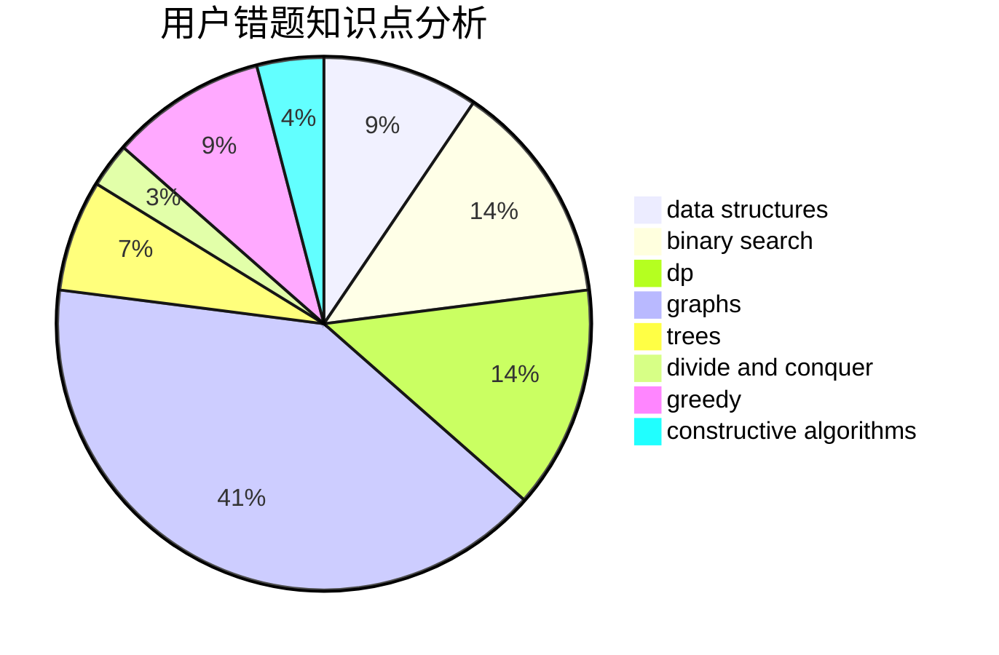

# wuruzhao

<!-- tabs:start -->

#### **用户提交结果分析**

#### **用户做题类型偏好分析**

#### **用户错题知识点分析**

<!-- tabs:end -->
# 推荐题目
[799F](https://codeforces.com/contest/799/problem/F)		data structures		  
[1080B](https://codeforces.com/contest/1080/problem/B)		math		  
[1466G](https://codeforces.com/contest/1466/problem/G)		combinatorics,
                        divide and conquer,
                        hashing,
                        math,
                        string suffix structures,
                        strings		  
[884D](https://codeforces.com/contest/884/problem/D)		data structures,
                        greedy		  
[476C](https://codeforces.com/contest/476/problem/C)		math		  
[1004C](https://codeforces.com/contest/1004/problem/C)		constructive algorithms,
                        implementation		  
[667C](https://codeforces.com/contest/667/problem/C)		dsu,graphs,sortings,trees		  
[35A](https://codeforces.com/contest/35/problem/A)		implementation		  
[1509C](https://codeforces.com/contest/1509/problem/C)		dp,
                        greedy		  
[400E](https://codeforces.com/contest/400/problem/E)		binary search,
                        bitmasks,
                        data structures		  
