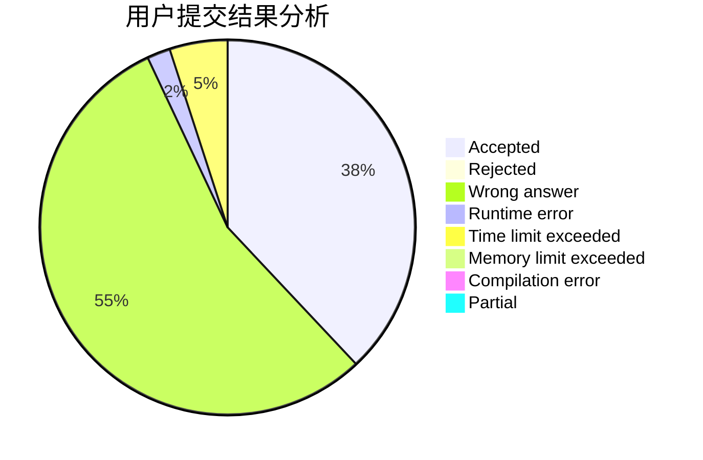
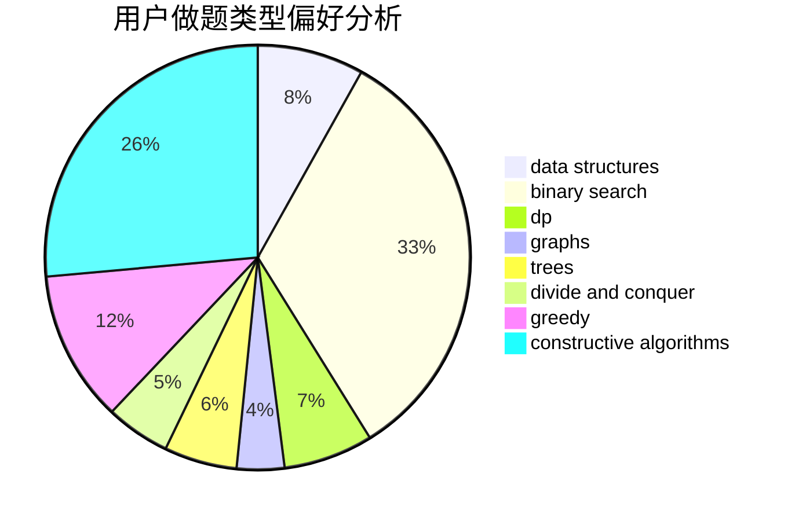

# wwch

<!-- tabs:start -->

#### **用户提交结果分析**

#### **用户做题类型偏好分析**

#### **用户错题知识点分析**

<!-- tabs:end -->
# 推荐题目
[1096E](https://codeforces.com/contest/1096/problem/E)		combinatorics,
                        dp,
                        math,
                        probabilities		  
[1454B](https://codeforces.com/contest/1454/problem/B)		implementation		  
[1101F](https://codeforces.com/contest/1101/problem/F)		binary search,
                        dp		  
[651D](https://codeforces.com/contest/651/problem/D)		dsu,graphs,sortings,trees		  
[1082F](https://codeforces.com/contest/1082/problem/F)		dp,
                        strings,
                        trees		  
[231A](https://codeforces.com/contest/231/problem/A)		brute force,
                        greedy		  
[269B](https://codeforces.com/contest/269/problem/B)		dp		  
[284B](https://codeforces.com/contest/284/problem/B)		brute force,
                        implementation		  
[805D](https://codeforces.com/contest/805/problem/D)		dsu,graphs,sortings,trees		  
[587E](https://codeforces.com/contest/587/problem/E)		data structures		  
