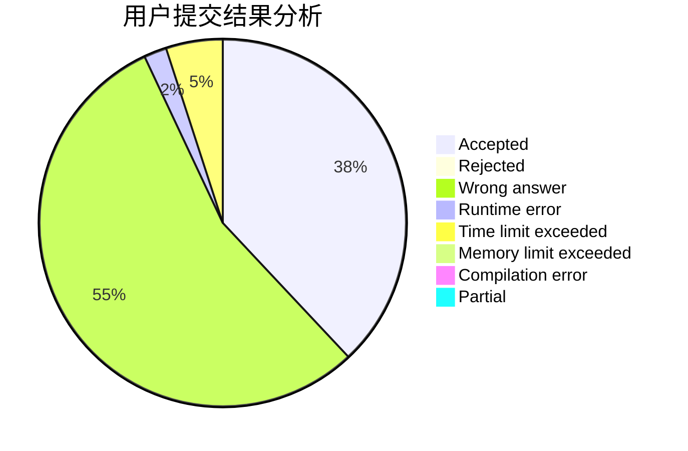
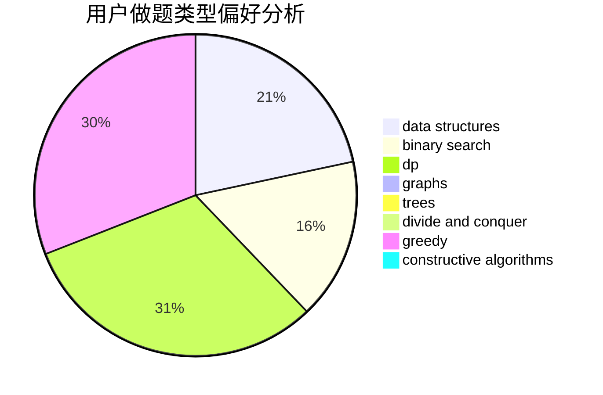

# wwch

<!-- tabs:start -->

#### **用户提交结果分析**

#### **用户做题类型偏好分析**

#### **用户错题知识点分析**

<!-- tabs:end -->
# 推荐题目
[1097A](https://codeforces.com/contest/1097/problem/A)		brute force,
                        implementation		  
[1463E](https://codeforces.com/contest/1463/problem/E)		constructive algorithms,
                        dfs and similar,
                        dsu,
                        graphs,
                        implementation,
                        sortings,
                        trees		  
[1102B](https://codeforces.com/contest/1102/problem/B)		greedy,
                        sortings		  
[675D](https://codeforces.com/contest/675/problem/D)		data structures,
                        trees		  
[1083B](https://codeforces.com/contest/1083/problem/B)		greedy,
                        strings		  
[251D](https://codeforces.com/contest/251/problem/D)		bitmasks,
                        math		  
[284E](https://codeforces.com/contest/284/problem/E)		dsu,graphs,sortings,trees		  
[2A](https://codeforces.com/contest/2/problem/A)		hashing,
                        implementation		  
[822A](https://codeforces.com/contest/822/problem/A)		implementation,
                        math,
                        number theory		  
[608A](https://codeforces.com/contest/608/problem/A)		implementation,
                        math		  
