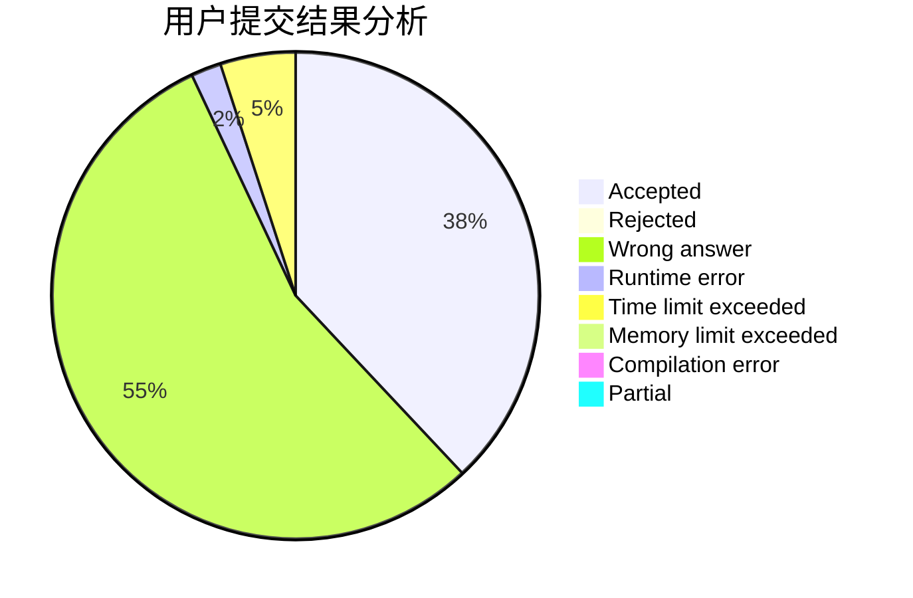
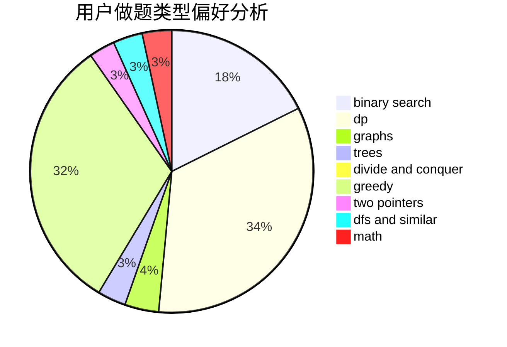

# wwch

<!-- tabs:start -->

#### **用户提交结果分析**

#### **用户做题类型偏好分析**

<!-- tabs:end -->
# 推荐题目
[1097A](https://codeforces.com/contest/1097/problem/A)
[1463E](https://codeforces.com/contest/1463/problem/E)
[1102B](https://codeforces.com/contest/1102/problem/B)
[675D](https://codeforces.com/contest/675/problem/D)
[1083B](https://codeforces.com/contest/1083/problem/B)
[251D](https://codeforces.com/contest/251/problem/D)
[284E](https://codeforces.com/contest/284/problem/E)
[2A](https://codeforces.com/contest/2/problem/A)
[822A](https://codeforces.com/contest/822/problem/A)
[608A](https://codeforces.com/contest/608/problem/A)
