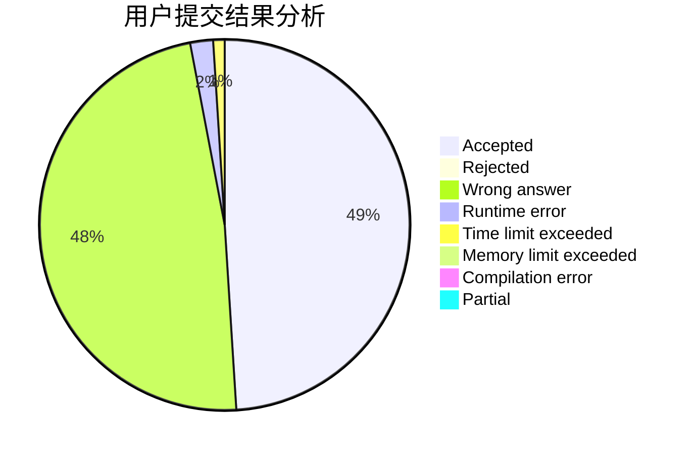
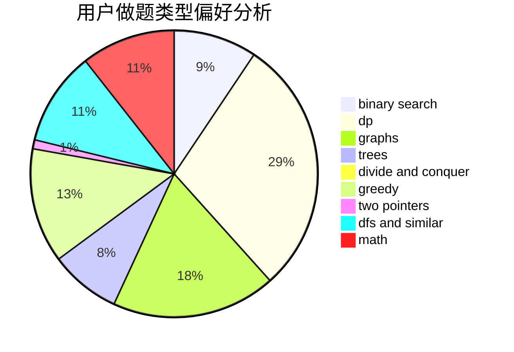

# wwl995

<!-- tabs:start -->

#### **用户提交结果分析**

#### **用户做题类型偏好分析**

<!-- tabs:end -->
# 推荐题目
[97D](https://codeforces.com/contest/97/problem/D)
[860B](https://codeforces.com/contest/860/problem/B)
[279B](https://codeforces.com/contest/279/problem/B)
[1151F](https://codeforces.com/contest/1151/problem/F)
[782E](https://codeforces.com/contest/782/problem/E)
[264B](https://codeforces.com/contest/264/problem/B)
[13571](https://codeforces.com/contest/1357/problem/1)
[887D](https://codeforces.com/contest/887/problem/D)
[631A](https://codeforces.com/contest/631/problem/A)
[12A](https://codeforces.com/contest/12/problem/A)
