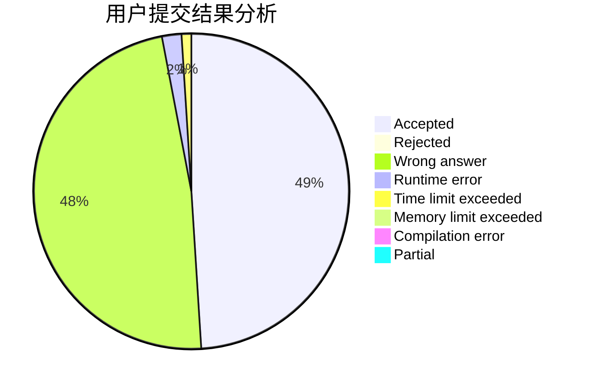
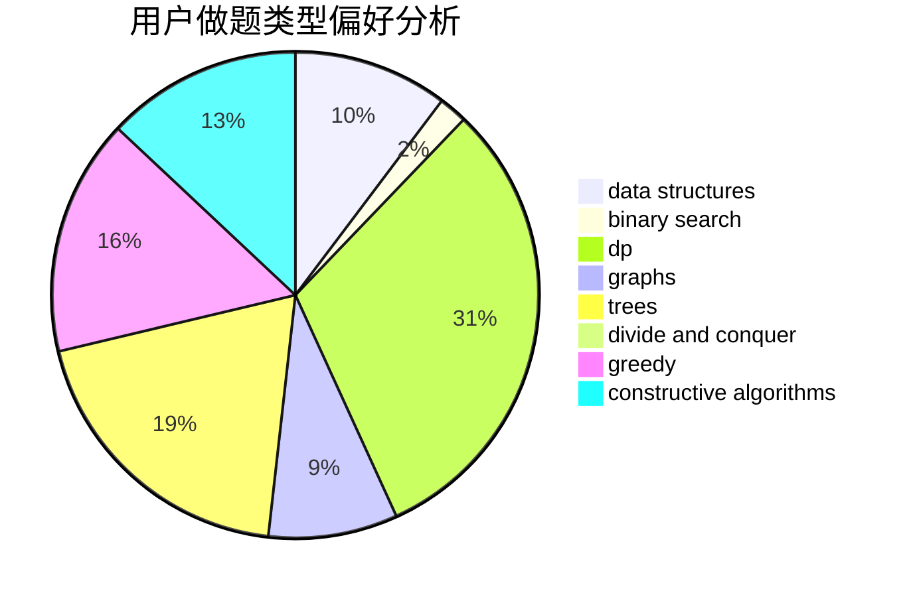

# wwl995

<!-- tabs:start -->

#### **用户提交结果分析**

#### **用户做题类型偏好分析**

#### **用户错题知识点分析**

<!-- tabs:end -->
# 推荐题目
[97D](https://codeforces.com/contest/97/problem/D)		bitmasks,
                        brute force,
                        implementation		  
[860B](https://codeforces.com/contest/860/problem/B)		dsu,graphs,sortings,trees		  
[279B](https://codeforces.com/contest/279/problem/B)		binary search,
                        brute force,
                        implementation,
                        two pointers		  
[1151F](https://codeforces.com/contest/1151/problem/F)		combinatorics,
                        dp,
                        matrices,
                        probabilities		  
[782E](https://codeforces.com/contest/782/problem/E)		dsu,graphs,sortings,trees		  
[264B](https://codeforces.com/contest/264/problem/B)		dp,
                        number theory		  
[13571](https://codeforces.com/contest/1357/problem/1)		dsu,graphs,sortings,trees		  
[887D](https://codeforces.com/contest/887/problem/D)		data structures,
                        two pointers		  
[631A](https://codeforces.com/contest/631/problem/A)		brute force,
                        implementation		  
[12A](https://codeforces.com/contest/12/problem/A)		implementation		  
