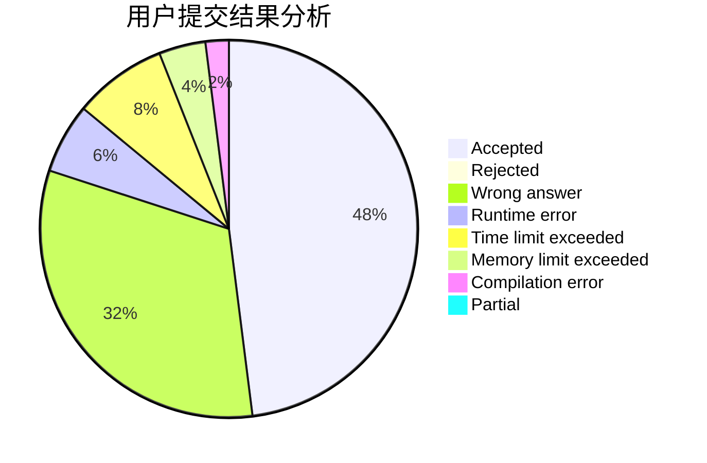
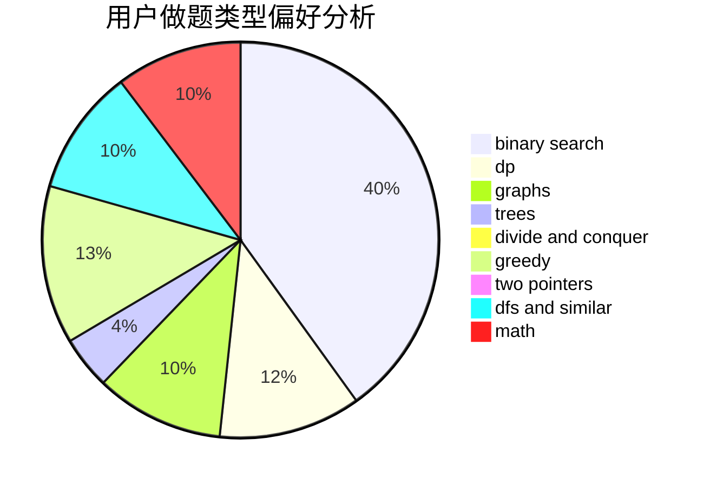

# wwlw

<!-- tabs:start -->

#### **用户提交结果分析**

#### **用户做题类型偏好分析**

<!-- tabs:end -->
# 推荐题目
[1004E](https://codeforces.com/contest/1004/problem/E)
[342C](https://codeforces.com/contest/342/problem/C)
[746B](https://codeforces.com/contest/746/problem/B)
[580C](https://codeforces.com/contest/580/problem/C)
[575B](https://codeforces.com/contest/575/problem/B)
[1013A](https://codeforces.com/contest/1013/problem/A)
[1424J](https://codeforces.com/contest/1424/problem/J)
[1511F](https://codeforces.com/contest/1511/problem/F)
[581A](https://codeforces.com/contest/581/problem/A)
[1182F](https://codeforces.com/contest/1182/problem/F)
