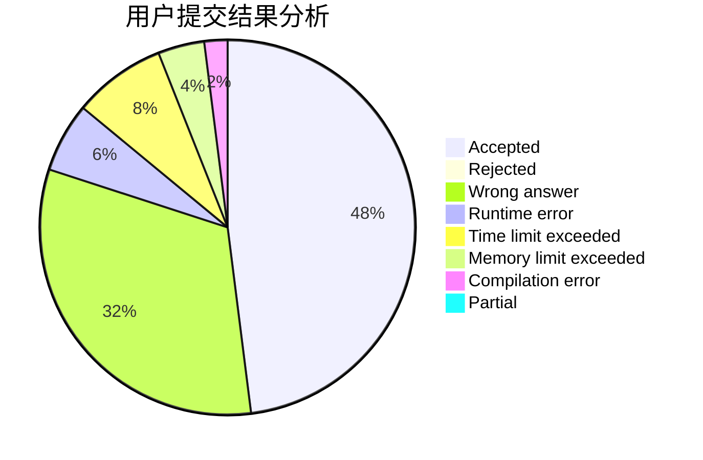
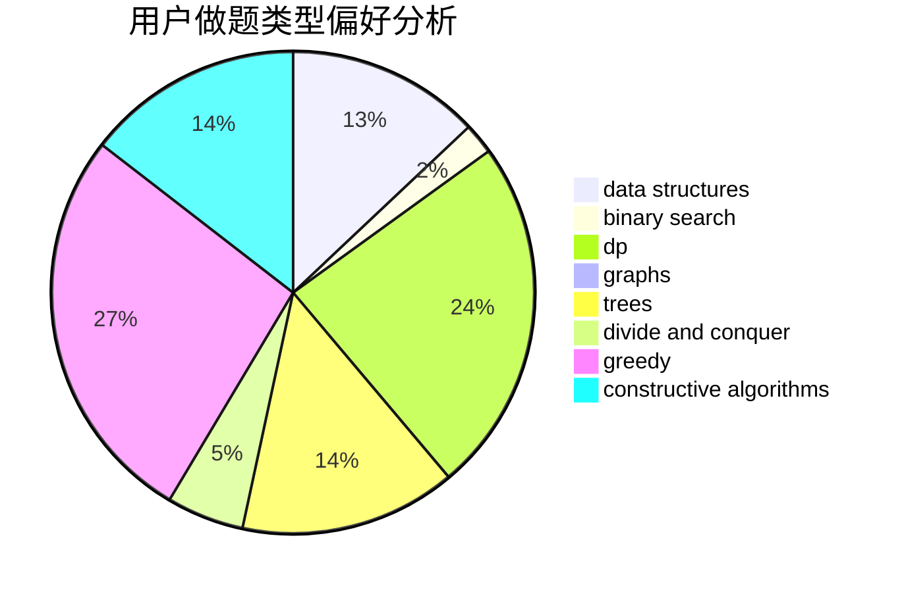
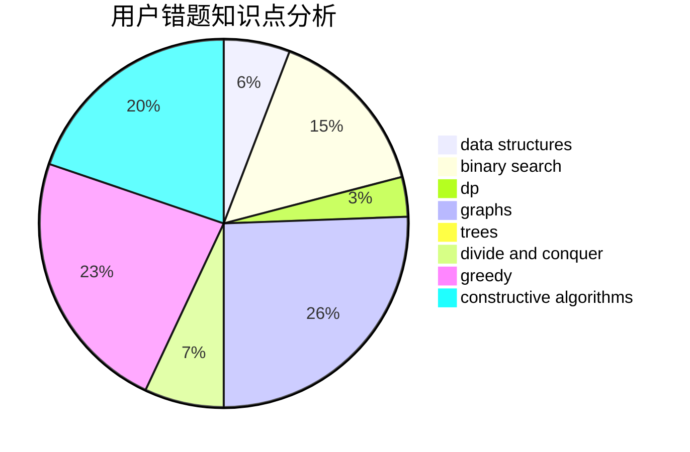

# wwlw

<!-- tabs:start -->

#### **用户提交结果分析**

#### **用户做题类型偏好分析**

#### **用户错题知识点分析**

<!-- tabs:end -->
# 推荐题目
[1004B](https://codeforces.com/contest/1004/problem/B)		constructive algorithms,
                        greedy,
                        implementation,
                        math		  
[316D3](https://codeforces.com/contest/316D/problem/3)		dp,
                        math		  
[729B](https://codeforces.com/contest/729/problem/B)		dp,
                        implementation		  
[557B](https://codeforces.com/contest/557/problem/B)		constructive algorithms,
                        implementation,
                        math,
                        sortings		  
[54B](https://codeforces.com/contest/54/problem/B)		hashing,
                        implementation		  
[1012C](https://codeforces.com/contest/1012/problem/C)		dp		  
[1417B](https://codeforces.com/contest/1417/problem/B)		greedy,
                        math,
                        sortings		  
[1501E](https://codeforces.com/contest/1501/problem/E)		dsu,graphs,sortings,trees		  
[558A](https://codeforces.com/contest/558/problem/A)		brute force,
                        implementation,
                        sortings		  
[117D](https://codeforces.com/contest/117/problem/D)		divide and conquer,
                        math		  
