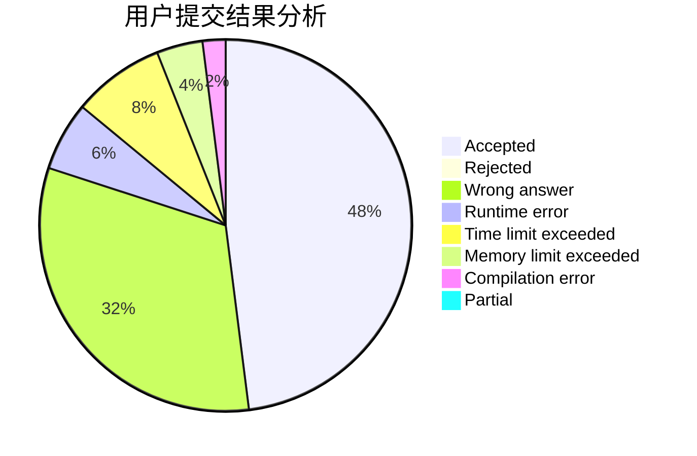
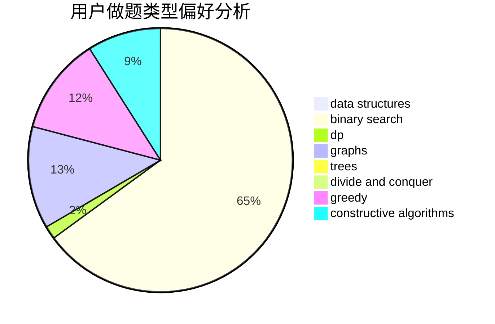
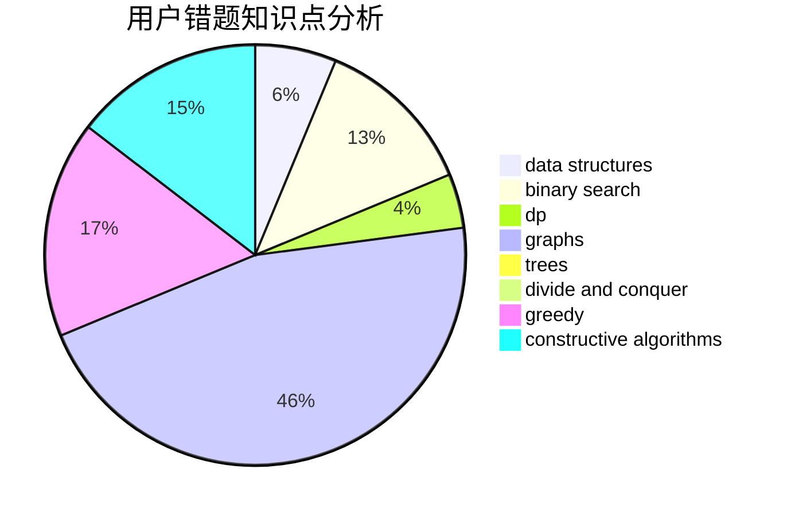

# wwlw

<!-- tabs:start -->

#### **用户提交结果分析**

#### **用户做题类型偏好分析**

#### **用户错题知识点分析**

<!-- tabs:end -->
# 推荐题目
[1004E](https://codeforces.com/contest/1004/problem/E)		binary search,
                        data structures,
                        dp,
                        greedy,
                        shortest paths,
                        trees		  
[342C](https://codeforces.com/contest/342/problem/C)		geometry		  
[746B](https://codeforces.com/contest/746/problem/B)		implementation,
                        strings		  
[580C](https://codeforces.com/contest/580/problem/C)		dfs and similar,
                        graphs,
                        trees		  
[575B](https://codeforces.com/contest/575/problem/B)		dfs and similar,
                        graphs,
                        trees		  
[1013A](https://codeforces.com/contest/1013/problem/A)		math		  
[1424J](https://codeforces.com/contest/1424/problem/J)		dsu,graphs,sortings,trees		  
[1511F](https://codeforces.com/contest/1511/problem/F)		brute force,
                        data structures,
                        dp,
                        matrices,
                        string suffix structures,
                        strings		  
[581A](https://codeforces.com/contest/581/problem/A)		implementation,
                        math		  
[1182F](https://codeforces.com/contest/1182/problem/F)		binary search,
                        data structures,
                        number theory		  
