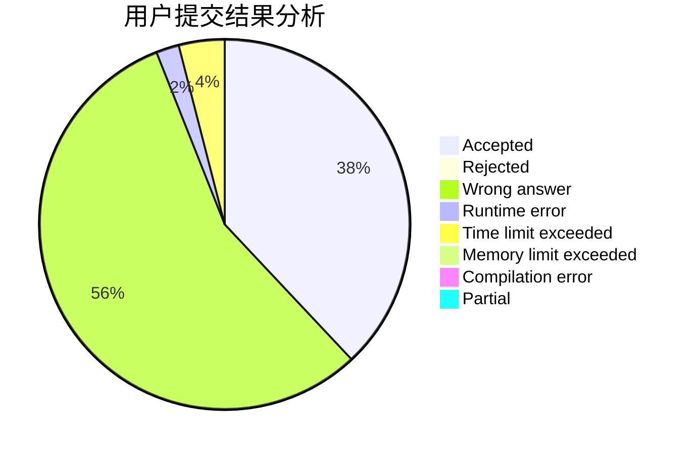
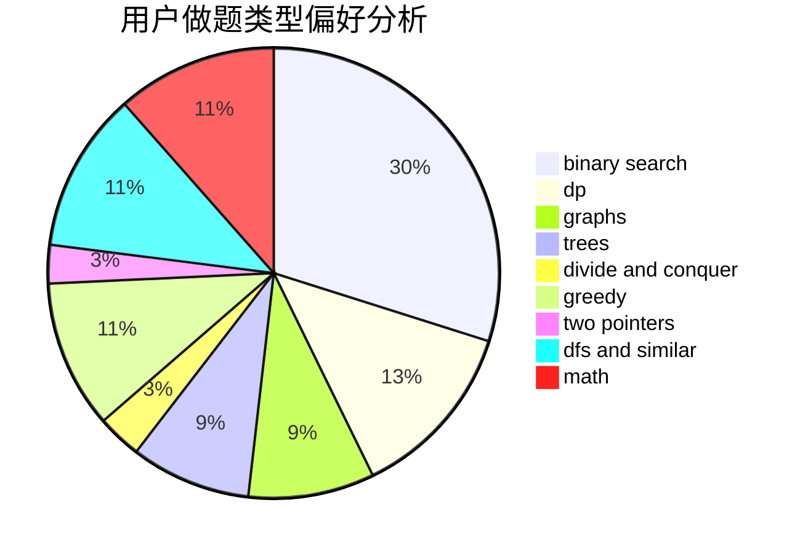

# Cannot_Register

<!-- tabs:start -->

#### **用户提交结果分析**

#### **用户做题类型偏好分析**

<!-- tabs:end -->
# 推荐题目
[1296F](https://codeforces.com/contest/1296/problem/F)
[1156D](https://codeforces.com/contest/1156/problem/D)
[514C](https://codeforces.com/contest/514/problem/C)
[666A](https://codeforces.com/contest/666/problem/A)
[631B](https://codeforces.com/contest/631/problem/B)
[1104C](https://codeforces.com/contest/1104/problem/C)
[665F](https://codeforces.com/contest/665/problem/F)
[1214E](https://codeforces.com/contest/1214/problem/E)
[371D](https://codeforces.com/contest/371/problem/D)
[666C](https://codeforces.com/contest/666/problem/C)
